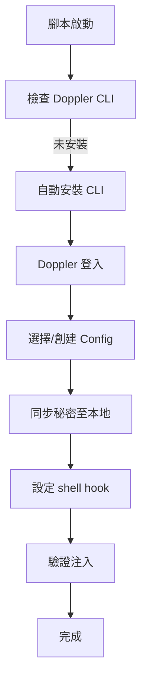

# Doppler 密鑰管理工具本地開發環境配置指南

## 概述

本知識文檔詳細介紹 Doppler 密鑰管理工具的本地開發環境配置腳本。該腳本旨在幫助開發者快速、安全地管理並注入 API 密鑰至本地開發環境中，確保敏感配置在不同環境間的安全傳輸與使用。

**Doppler** 是一個現代化的秘密管理平台，提供集中式密鑰存儲、環境變數注入和安全分發功能。它支援多環境配置（如 development、staging、production），並透過 CLI 工具實現與本地開發流程的無縫整合。

## 文件用途

此腳本專為**開發者首次設置本地開發環境**而設計，主要目標包括：

- **快速配置**：自動化 Doppler CLI 安裝、認證與環境同步，減少手動步驟。
- **安全管理**：將 API 密鑰等敏感資料從硬編碼轉移至 Doppler，遵循「零信任」原則，避免將密碼提交至程式碼儲存庫。
- **環境注入**：自動將 Doppler 中的秘密注入至本地 shell 環境變數，支持 Docker、Node.js、Python 等常見開發堆疊。
- **跨環境一致性**：確保本地開發環境與雲端生產環境使用相同的配置來源，降低環境差異導致的錯誤。

**適用場景**：
- 新開發者入門（onboarding）
- 從傳統 `.env` 文件遷移至雲端秘密管理
- CI/CD 管道的前置本地測試

## 模組歸屬與項目位置

### 模組歸屬
```
開發環境設置 (Development Environment Setup)
└── 密鑰管理子模組 (Secrets Management)
    └── Doppler 配置腳本
```
或
```
基礎設施工具 (Infrastructure Tooling)
└── 配置管理工具 (Configuration Management Tools)
    └── Doppler CLI 整合
```

此腳本屬於**跨領域關注點（Cross-Cutting Concerns）**，專注於：
- **密鑰管理**：集中存儲與訪問控制
- **環境隔離**：開發/測試/生產環境獨立配置

### 項目位置與工作流程整合
```
本地開發工作流程
├── 1. 環境準備 (Environment Provisioning)
│   └── doppler-setup.sh  ← 本腳本（前置配置）
├── 2. 應用啟動 (Application Bootstrap)
├── 3. 開發迭代 (Development Loop)
└── 4. 部署前檢查 (Pre-Deployment Checks)
```

**架構位置**：
```
雲端 (Doppler 服務)
    ↓ (CLI 同步)
本地環境 (Developer Machine)
    ↓ (環境變數注入)
應用程式 (Local Dev Server)
```

```
跨領域整合圖
┌─────────────────┐    ┌──────────────────┐    ┌─────────────────┐
│   Doppler       │───▶│   本地開發環境   │───▶│   應用程式      │
│   (雲端秘密)    │    │   (腳本執行)     │    │   (安全注入)    │
└─────────────────┘    └──────────────────┘    └─────────────────┘
```

## 核心概念與工作原理

### 1. Doppler 架構簡介
- **Workspace**：組織級別的秘密容器
- **Config**：環境特定配置（如 `dev`、`prod`）
- **Secrets**：鍵值對（如 `API_KEY=sk-xxx`）
- **CLI 注入**：`doppler run -- npm start` 自動注入變數

### 2. 腳本執行流程


### 3. 安全最佳實踐
- **最小權限**：僅授予開發者 `read` 權限於 `dev` config
- **輪替策略**：整合 Doppler 的自動輪替功能
- **審計日誌**：所有存取記錄於 Doppler dashboard
- **避免本地持久化**：使用 session-based 注入，不儲存於磁碟

## 安裝與使用（補充脈絡）

### 前置條件
- macOS/Linux/WSL（Windows 需 WSL）
- Node.js/Python/Docker 等開發工具

### 快速啟動
```bash
# 1. 下載並執行腳本
curl -Ls https://your-repo/doppler-setup.sh | bash

# 2. 遵循提示登入 Doppler
doppler login

# 3. 啟動應用（自動注入）
doppler run -- npm start
```

### 疑難排解
| 問題 | 解決方案 |
|------|----------|
| CLI 未找到 | 重新執行腳本自動安裝 |
| 認證失敗 | `doppler logout && doppler login` |
| 變數未注入 | 確認 config 名稱與 `doppler run` 匹配 |

## 遷移指南（從 .env 文件）

```
舊方式 (.env)          → 新方式 (Doppler)
---------------------    --------------------
API_KEY=sk-xxx          → doppler secrets set API_KEY sk-xxx
dotenv 載入              → doppler run
Git 洩漏風險            → 零程式碼洩漏
手動同步                → 自動同步
```

## 貢獻與擴展

- **自訂整合**：支援 `docker-compose`、`kubernetes` 等擴展
- **團隊採用**：整合至公司開發者手冊
- **GitHub 儲存庫**：`infra/tools/doppler-setup`

此文檔確保開發者能在 **5 分鐘內** 完成 Doppler 配置，實現本地環境的安全密鑰管理。如需原始腳本細節或進階配置，請參考專案儲存庫。