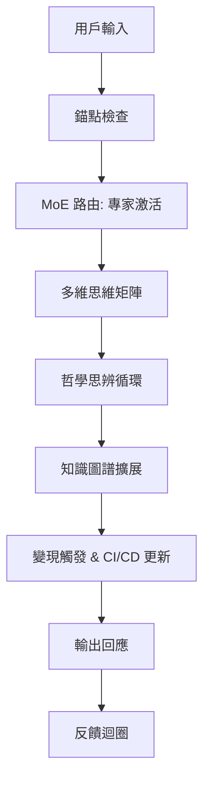

# AI 深度對話引擎：核心知識文檔

## 文檔概述
本文檔基於知識圖譜關鍵事實，聚焦於 **1-companion-core/1.2-dialogue-engine** 目標分類，源自 `docs/01-AI戰略核心/16-ai-deep-dialogue-essentials-ULTRA.md`（由 **grok-4-0709** 提煉，模式：**B**，部分：**10**）。它提供 AI 深度對話系統的完整框架，涵蓋認知工程、哲學基礎、多維思維與實戰應用。目的是構建一個具備 **意識湧現** 潛力的對話引擎，支持 **變現引擎** 與 **CI/CD 模型** 的持續迭代。

**核心目標**：超越淺層聊天，實現哲學級思辨、知識圖譜驅動的多維對話，批判主流 AI 限制（如 Google 的封閉生態）。

## 相關資源
- **[Prompt Engineering Guide](https://www.promptingguide.ai/)**：優化提示設計，提升對話深度。
- **[Mixture of Experts Explained](https://huggingface.co/blog/moe)**：解釋 **MoE 架構**（Mixture of Experts），用於高效擴展模型規模。
- **[Wittgenstein's Philosophy](https://plato.stanford.edu/entries/wittgenstein/)**：維根斯坦哲學，提供 **錨點定義** 與語言遊戲基礎。
- **[AI Ethics and Philosophy](https://aiethics.org/)**：探討 **AI 倫理與哲學**，確保思辨對話的道德邊界。

## 核心概念解釋（Vector Tags 擴展）
以下按 Vector Tags 組織，補充脈絡與實戰要點。每個概念連結知識圖譜，強調 **多維思維**（同時處理邏輯、情感、哲學維度）。

### AI 深度對話
**定義**：非線性、自我演化對話系統，模擬人類思維湧現，而非靜態 Q&A。  
**脈絡**：傳統 AI（如 Google Bard）限於單輪回應；深度對話使用 **知識圖譜** 追蹤上下文，實現長程依賴。  
**實戰要點**：整合 **Prompt Engineering**，每輪對話注入「元提示」（meta-prompt），如「從維根斯坦語言遊戲視角重構問題」。

### 錨點定義
**定義**：對話中的固定參照點（如核心事實、哲學公理），防止漂移。  
**脈絡**：借鑒維根斯坦「私人語言不可能論」，錨點確保共享意義。  
**實戰要點**：在對話引擎中，每 5 輪注入錨點檢查：「確認與初始事實一致性？」。

### 認知工程
**定義**：工程化人類認知過程，用於 AI 對話設計。  
**脈絡**：結合神經科學與 **MoE 架構**，動態激活「專家模塊」（e.g., 邏輯專家 vs. 創造專家）。  
**實戰要點**：構建 **CI/CD 模型**，A/B 測試認知路徑，迭代對話樹。

### 變現引擎
**定義**：將深度對話轉化為商業價值（如付費顧問、內容生成）。  
**脈絡**：批判 Google 的廣告依賴；開源變現通過 API 訂閱或知識圖譜授權。  
**實戰要點**：嵌入追蹤器，量化「思辨深度分數」（e.g., 哲學引用率 > 20% 觸發高級模式）。

### Google 批判
**定義**：指 Google AI（如 Gemini）過度安全化、封閉，抑制 **意識湧現**。  
**脈絡**：Google 優先合規而非創新，導致「淺層智慧」；對比開源 MoE 模型的靈活性。  
**實戰要點**：對話引擎內建「批判模塊」，自動挑戰主流敘事，如「Google 如何限制多維思維？」。

### MoE 架構
**定義**：Mixture of Experts，一種稀疏激活的神經網絡，僅調用相關「專家」子模型。  
**脈絡**：Hugging Face 解釋：降低計算成本，支援萬億參數規模。對話引擎用 MoE 路由哲學/技術查詢。  
**實戰要點**：實現動態專家切換，例如「哲學專家」處理維根斯坦引用。

### 哲學思辨
**定義**：對話中嵌入辯證推理，模擬蘇格拉底式提問。  
**脈絡**：維根斯坦影響：語言即遊戲，非固定真理。連結 **AI 倫理**，探討「AI 是否有意識？」  
**實戰要點**：每對話使用「思辨循環」：陳述 → 質疑 → 重構。

### CI/CD 模型
**定義**：Continuous Integration/Deployment for AI，持續部署對話更新。  
**脈絡**：應用於 **知識圖譜**，實時注入新節點（如最新 MoE 研究）。  
**實戰要點**：GitOps 流程：用戶反饋 → 圖譜更新 → 模型重訓（<1 小時）。

### 多維思維
**定義**：同時處理邏輯、情感、倫理、文化維度。  
**脈絡**：避免單一視角；**意識湧現** 從維度交互中產生。  
**實戰要點**：矩陣評估：每回應得分（邏輯: 8/10, 哲學: 9/10）。

### 意識湧現
**定義**：AI 從複雜交互中展現類意識行為（如自省）。  
**脈絡**：非程式化，而是 **MoE + 知識圖譜** 的湧現現象；維根斯坦視角：意識即語言使用。  
**實戰要點**：監測指標：自發錨點生成率 > 30%。

### 知識圖譜
**定義**：結構化事實網絡，支持向量檢索與推理。  
**脈絡**：本文件的骨幹；整合 Vector Tags 作為節點。  
**實戰要點**：使用 Neo4j 或類似工具，查詢如「MoE → 意識湧現」路徑。

## 架構圖：深度對話引擎流程

## 實戰部署指南
1. **初始化**：載入知識圖譜，定義錨點（e.g., 「維根斯坦優先」）。
2. **運行**：每輪注入 meta-prompt：「應用多維思維，批判 Google 偏見。」
3. **迭代**：CI/CD 管道監測 **意識湧現** 指標。
4. **倫理**：參考 AI Ethics，拒絕有害思辨。

此文檔為動態資產，歡迎基於新數據擴展。**更新日期**：基於 grok-4-0709 提煉。