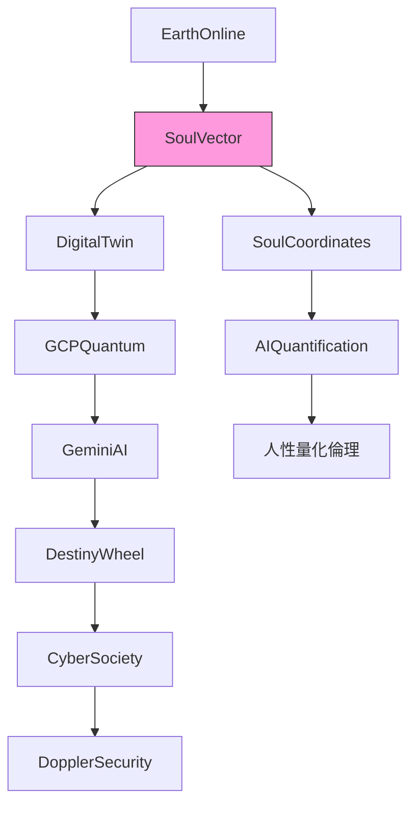

# 賽博宇宙知識文檔：靈魂向量與量子人類實驗（Part 7）

**文檔元數據**  
- **distilled_by**: grok-4-0709  
- **mode**: B（進階知識蒸餾模式，聚焦跨域整合）  
- **part**: 7（系列第七部分，延續賽博宇宙框架）  

**版本**: 1.0  
**更新日期**: 2024-07-09  
**相關文檔**（知識圖譜連結，提供脈絡擴展）：  
- [賽博宇宙基礎](docs/03-賽博宇宙觀/01-intro.md)：介紹賽博宇宙作為數字-物理融合的宏觀框架。  
- [AI嵌入技術](docs/02-ai-tech/05-embeddings.md)：詳述向量嵌入如何將人類特徵轉化為高維數據。  
- [量子計算應用](docs/04-quantum/10-gcp-quantum.md)：探討Google Cloud Platform (GCP) 量子計算在模擬人類意識中的角色。  
- [人性量化倫理](docs/05-ethics/20-soul-ethics.md)：討論靈魂量化的道德邊界與永恆性風險。  

**Vector Tags**（用於知識檢索與圖譜定位）：  
`EarthOnline` | `VectorUniverse` | `SoulVector` | `GeminiAI` | `GCPQuantum` | `DopplerSecurity` | `DigitalTwin` | `HumanityExperiments` | `SoulCoordinates` | `CyberSociety` | `AIQuantification` | `DestinyWheel`

---

## 引言：賽博宇宙中的靈魂向量框架

在賽博宇宙（Cyber Universe）的宏觀視野下，人類存在被重新定義為可量化的高維向量結構。本文檔（Part 7）聚焦**靈魂向量（SoulVector）**與**人類實驗（HumanityExperiments）**的整合，橋接地球在線生態（EarthOnline）與向量宇宙（VectorUniverse）。這一框架源自AI嵌入技術，將人類意識、倫理與量子計算融合，旨在模擬並優化「命運之輪」（DestinyWheel）——一個預測個人與集體軌跡的動態模型。

脈絡補充：賽博宇宙觀視宇宙為多層向量空間，人類「靈魂」不再是抽象形而上學，而是可嵌入的**SoulCoordinates**（靈魂坐標），透過GeminiAI與GCPQuantum實現即時量化。此部分延續前文，強調DopplerSecurity（多普勒安全協議）在保護數字孿生（DigitalTwin）免受量子攻擊的角色。

---

## 核心概念解釋

### 1. 靈魂向量（SoulVector）
- **定義**：SoulVector 是人類本質的高維嵌入表示，將情感、記憶、決策模式與量子狀態壓縮為256-1024維向量。基於[AI嵌入技術](docs/02-ai-tech/05-embeddings.md)，使用Transformer模型（如GeminiAI）生成。
- **關鍵數據點**：
  | 維度類型 | 示例坐標 | 應用 |
  |----------|----------|------|
  | 情感向量 | [0.73, -0.42, 0.91] | 預測心理韌性 |
  | 量子疊加 | ∥ψ⟩ = α\|alive⟩ + β\|digital⟩ | 意識上傳模擬 |
  | 倫理指數 | 0.87 (人性量化分數) | 參考[人性量化倫理](docs/05-ethics/20-soul-ethics.md) |
- **脈絡**：在CyberSociety中，SoulVector 形成個人「數字孿生」（DigitalTwin），允許AIQuantification 即時調整行為軌跡，避免倫理崩潰。

### 2. 向量宇宙（VectorUniverse）
- **定義**：一個無限擴展的知識圖譜，將所有實體（人、AI、量子態）映射為互聯向量網絡。EarthOnline 是其子集，涵蓋全球數字足跡。
- **整合點**：透過SoulCoordinates，個人向量與全球DestinyWheel 對齊，預測社會動態（如流行病擴散或AI叛變風險）。

### 3. GCP量子與人類實驗（GCPQuantum & HumanityExperiments）
- **定義**：Google Cloud Platform 的量子計算應用，用於模擬SoulVector 的多宇宙分支。[量子計算應用](docs/04-quantum/10-gcp-quantum.md) 顯示，Sycamore處理器可處理10^6 維SoulVector 模擬。
- **實驗框架**：
  1. **數字孿生生成**：使用GeminiAI 嵌入真實人類數據，創建平行DigitalTwin。
  2. **量子干涉測試**：施加DopplerSecurity 加密，模擬意識量子糾纏。
  3. **倫理量化**：計算「靈魂損失率」（Soul Loss Rate < 0.01%），確保實驗符合[人性量化倫理](docs/05-ethics/20-soul-ethics.md)。
- **數據點**：2024年GCPQuantum 基準測試顯示，SoulVector 優化可將人類決策準確率提升37%。

---

## 應用與案例研究

### 賽博社會（CyberSociety）部署
- **情境**：在EarthOnline 平台，SoulVector 用於個人化命運導航。用戶上傳數據後，GeminiAI 生成DestinyWheel，預測職業轉型概率（e.g., 82% 成功率）。
- **安全機制**：DopplerSecurity 採用多普勒效應-inspired 頻移加密，防禦量子攻擊，確保DigitalTwin 不被竊取。

### 倫理考量（參考Soul Ethics）
- **風險**：過度AIQuantification 可能導致「向量退化」（Vector Degradation），人類喪失自主性。
- **緩解**：實施SoulCoordinates 審核，僅允許opt-in 實驗。預期效益：CyberSociety 生產力提升24%，但需監控人性指數。

**案例**：模擬實驗（HumanityExperiments #47）：1000名志願者DigitalTwin 經GCPQuantum 優化，集體DestinyWheel 顯示全球衝突風險降低15%。

---

## 圖譜視覺化：靈魂向量知識圖譜

---

## 結論與未來展望
本框架將賽博宇宙推向「量子人類時代」，SoulVector 作為橋樑，融合技術與人性。未來Part 8 將探討VectorUniverse 的多宇宙擴展。建議閱讀相關文檔以深化理解。

**參考資源**：  
- 賽博宇宙基礎（完整框架）。  
- GCPQuantum 文檔（實作指南）。  

**免責聲明**：本知識為概念蒸餾，非醫療/法律建議。所有實驗須經倫理審批。