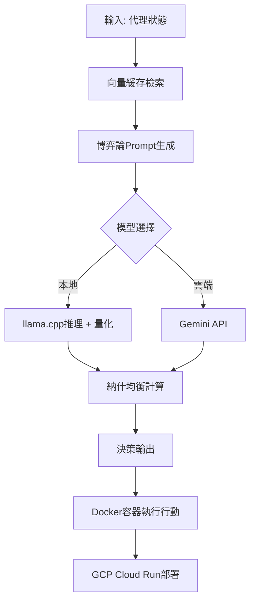

# 多代理AI系統架構知識文檔

## 概述
本知識文檔基於提供的知識圖譜關鍵事實，詳細介紹一個以**多代理系統（Multi-Agent Systems, MAS）**為核心的AI架構。該系統整合博弈論決策機制、模型推理優化及雲端部署實踐，適用於複雜決策支持場景，如賽博宇宙觀中的智能代理互動。系統強調**納什均衡**在多代理協作中的應用，透過Go語言後端、llama.cpp推理框架及Gemini API整合，實現高效、低成本的AI決策支持。

系統核心目標：構建可擴展的多代理環境，讓代理間透過博弈論策略達成穩定均衡，支援向量資料檢索加速及雲端資源優化。

## 核心概念與技術標籤
以下為系統關鍵Vector Tags，提供快速索引：

| 標籤 | 描述 | 應用脈絡 |
|------|------|----------|
| **AI代理系統** | 多代理架構基礎 | 代理間自治互動，參考[Multi-Agent Systems基礎](docs/03-賽博宇宙觀/01-mas-intro.md) |
| **多代理架構** | 納什均衡應用 | 代理群組決策優化 |
| **納什均衡** | 博弈論決策支持 | 確保代理策略穩定，無單方偏差動機；詳見[博弈論在AI中的應用](docs/04-theory/02-game-theory-ai.md) |
| **Go語言開發** | 後端實現 | 高併發後端服務，處理代理通訊 |
| **llama.cpp** | 模型推理框架 | 本地高效推理，支援量化模型 |
| **Gemini API** | 外部模型整合 | 混合推理，補充llama.cpp能力 |
| **模型量化** | 效能優化 | 降低記憶體需求，提升推理速度 |
| **Docker部署** | 容器化部署 | 標準化環境，易於擴展 |
| **成本優化** | 雲端資源管理 | GCP動態資源調度 |
| **決策支持** | AI系統核心功能 | 基於博弈論的策略推薦 |
| **向量緩存** | 資料檢索加速 | RAG-like檢索，加速知識圖譜查詢 |
| **博弈論應用** | AI策略設計 | 納什均衡模擬代理競爭/合作 |

## 系統架構詳解

### 1. 多代理系統基礎（MAS）
- **脈絡**：MAS模擬真實世界代理互動，每個代理具備感知、決策及行動能力。系統採用**多代理架構**，代理間透過通訊協定交換狀態，实现集體智能。
- **關鍵技術**：
  - **納什均衡**：在非合作博弈中，無代理能單獨改變策略獲益更多。應用於資源分配、競爭任務中，確保系統穩定。
  - 示例：兩個代理爭奪資源時，計算均衡點，避免無限競爭。
- **相關資源**：[Multi-Agent Systems基礎](docs/03-賽博宇宙觀/01-mas-intro.md)。

### 2. 博弈論整合與決策支持
- **脈絡**：博弈論提供數學框架，模擬代理理性決策。系統將**納什均衡**嵌入決策引擎，支持動態策略調整。
- **實現細節**：
  - 使用**Prompt Engineering**生成博弈情境提示（參考[Prompt Engineering指南](docs/02-ai-tools/05-prompt-engineering.md)）。
  - 決策流程：狀態輸入 → 博弈模擬 → 均衡計算 → 行動輸出。
- **優勢**：提升**決策支持**準確性，適用於��確定環境。
- **相關資源**：[博弈論在AI中的應用](docs/04-theory/02-game-theory-ai.md)。

### 3. 後端開發與模型推理
- **Go語言開發**：後端核心，使用Goroutines處理高併發代理請求。負責代理通訊、向量緩存管理及API路由。
- **推理框架**：
  - **llama.cpp**：輕量級C++框架，本地運行開源LLM。支援GPU加速，適合邊緣部署。
  - **Gemini API**：雲端整合，處理複雜任務（如長上下文博弈分析）。
  - **模型量化**：將FP16模型轉為INT8/INT4，減少80%記憶體使用，提升推理速度3-5倍。
- **向量緩存**：使用FAISS或類似庫預存嵌入向量，加速知識檢索（RAG模式）。

### 4. 部署與優化
- **Docker部署**：每個代理/服務容器化，支援Kubernetes Orchestration。Dockerfile示例包含llama.cpp依賴及Go二進位檔。
- **雲端實踐**：
  - **GCP部署**：使用Cloud Run無伺服器架構，按需擴展。
  - **成本優化**：自動縮放、預熱緩存，模型量化降低GPU小時費用50%。
- **相關資源**：[GCP部署最佳實踐](docs/05-cloud/03-gcp-run.md)。

## 部署流程圖

## 最佳實踐與注意事項
- **效能調優**：優先量化模型，監控向量緩存命中率>90%。
- **安全性**：代理通訊使用gRPC + TLS；限制Gemini API權限。
- **擴展性**：支援動態代理註冊，博弈矩陣預計算加速。
- **潛在挑戰**：納什均衡計算複雜度O(n^2)，適合小規模代理群（<100）。

## 參考文檔
- [Multi-Agent Systems基礎](docs/03-賽博宇宙觀/01-mas-intro.md)
- [Prompt Engineering指南](docs/02-ai-tools/05-prompt-engineering.md)
- [博弈論在AI中的應用](docs/04-theory/02-game-theory-ai.md)
- [GCP部署最佳實踐](docs/05-cloud/03-gcp-run.md)

*文檔最後更新：基於最新知識圖譜事實。建議定期同步向量標籤以維持準確性。*