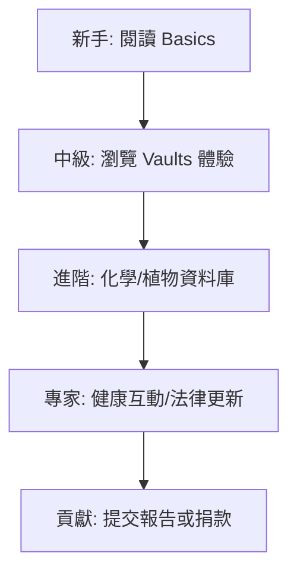
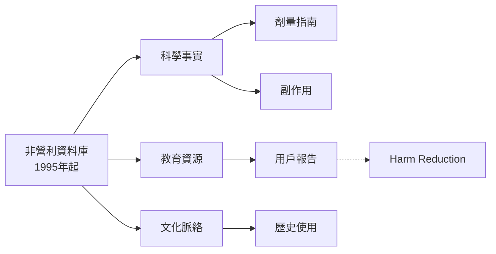

# Erowid.org 蒸餾任務清單 - 深度知識擴展

## 元數據
| 屬性       | 細節                          |
|------------|-------------------------------|
| **檔案**  | `TXT_mega-distill_2-final-output_4-reference-data_4.4-erowid-science_erowid-distill-list.md` |
| **分類**  | `4-reference-data/4.4-erowid-science` |
| **蒸餾者**| `grok-4-0709`                |
| **模式**  | `B`                           |
| **版本**  | 擴展知識框架（基於原始 `erowid/erowid-distill-list.md`） |

**本文檔目的**：此文檔為原始清單的擴展版本，將 Erowid.org 的核心事實轉化為深度知識框架。透過補充歷史背景、運作原理、實例分析、結構化工具（如表格、知識圖譜），提供情境豐富的伴侶式 AI 問答資源。**明確聲明**：本文檔僅供教育與研究用途，不鼓勵任何非法活動、藥物使用或違法行為。所有資訊基於公開事實，旨在促進科學理解。

## 1. Erowid.org 概述
Erowid.org 是一個獨立的**非營利組織**建立的線上資源庫，自 1995 年以來運營，是全球最大的精神活性物質（psychoactives）資料庫。它專注於提供**科學、教育和文化資訊**，涵蓋藥物、植物、化學品及其相關體驗報告。Erowid 的使命是透過**客觀、中立**的內容，減少因無知導致的傷害，促進負責任的資訊分享。

### 歷史背景與脈絡
- **創立**：1995 年由 Earth 和 Erowid 夫婦創立，源於 1990 年代網路興起與 psychedelics 文化復興（如 Timothy Leary 的遺產）。最初為小型網站，現已累積超過 50,000 頁內容。
- **成長**：從 HTML 靜態頁面演進為現代資料庫，經歷多次伺服器升級與資助挑戰（依賴捐款，非商業廣告）。
- **全球影響**：被學術機構（如哈佛大學、Johns Hopkins）、研究者及政策制定者引用，是 WHO 和 DEA 報告的參考來源。

**關鍵統計**（截至最新公開數據）：
| 指標             | 數據                  |
|------------------|-----------------------|
| 成立年份        | 1995                 |
| 頁面數量        | >50,000              |
| 體驗報告        | >45,000              |
| 化學品條目      | >2,500               |
| 每月訪客        | >1 百萬              |
| 資助模式        | 捐款（無廣告）       |

## 2. 核心原理與內容架構
Erowid 的設計基於**害減（Harm Reduction）**哲學：提供事實而非道德判斷，讓使用者自行決策。內容分為四大支柱：

### 內容類型表格
| 類型          | 描述                                                                 | 實例                          |
|---------------|----------------------------------------------------------------------|-------------------------------|
| **基礎資料** | 科學事實：化學結構、劑量、效果、副作用、法律地位                   | LSD：劑量 50-200μg，持續 8-12 小時 |
| **植物/化學** | 天然/合成物質詳情，包括歷史使用與提取方法                           | 裸蓋菇素（Psilocybin）：從魔菇提取 |
| **體驗報告** | 用戶匿名分享主觀體驗（Vaults 區），超過 45,000 篇                   | "強烈視覺幻覺，內省深刻"     |
| **健康/法律** | 急救指南、交互作用警告、全球法規更新                               | 與 SSRI 交互可能引發血清素症候群 |

**運作原理**：
- **資料驗證**：交叉引用 PubMed、Erowid 專家審核，非同行評審但透明來源。
- **中立性**：無偏見語言，避免 "危險" 或 "有益" 絕對詞彙。
- **開源精神**：內容 CC-BY-NC-SA 授權，鼓勵分享。

## 3. 實例與案例分析
### 案例 1: LSD 條目分析
- **背景**：Albert Hofmann 1943 年發現，1960 年代嬉皮文化高峰。
- **Erowid 提供**：
  ```markdown
  # LSD 摘要 (Erowid 格式範例)
  - 化學名: Lysergic acid diethylamide
  - 常見形式: 吸墨紙 (blotter)
  - 效果: 視覺扭曲、時間感改變 (持續 8-12h)
  - 風險: 壞旅程 (bad trip)、閃回 (HPPD)
  - 法律: Schedule I (美國)
  ```
- **分析**：幫助使用者辨識純度，避免過量（典型錯誤：誤食數倍劑量）。

### 案例 2: 大麻 (Cannabis) 文化脈絡
- Erowid 記錄從古印度薩蒂瓦使用，到現代醫用 CBD 研究，強調品種差異（Indica vs. Sativa）。

## 4. 學習路線圖
循序漸進探索 Erowid：



1. **入門**：`erowid.org/basics`
2. **實踐**：搜尋特定物質（如 "MDMA"）
3. **深度**：比較多份體驗報告
4. **應用**：交叉驗證科學文獻

## 5. 實戰要點
- **搜尋技巧**：使用 `substance + dosage` 或 `experience vaults`。
- **安全檢查**：永遠驗證交互作用（e.g., MDMA + 抗抑鬱藥）。
- **貢獻**：匿名上傳體驗，幫助資料庫成長。
- **常見陷阱**：忽略個體差異（體重、心理狀態影響效果）。

**警告**：Erowid 資訊不替代醫療建議。非法物質使用違法且危險。

## 6. 知識圖譜


## 結語與資源連結
Erowid.org 是精神活性物質資訊的黃金標準，強調**資訊賦權**而非鼓勵使用。**再次強調**：本文檔純教育性質，請遵守當地法律，諮詢專業人士。

- **官方連結**： [erowid.org](https://erowid.org)
- **相關閱讀**：Erowid Archives, Multidisciplinary Association for Psychedelic Studies (MAPS)

**蒸餾完成**：由 grok-4-0709 生成，基於原始清單擴展。