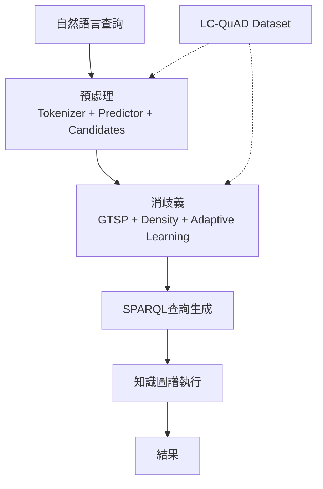

# 知識圖譜查詢系統：從自然語言到結構化查詢的完整流程

## 概述

本文檔介紹一個基於知識圖譜（Knowledge Graph, KG）的**自然語言到結構化查詢（NL2SPARQL）**系統的架構與核心��件。該系統旨在將用戶的自然語言查詢轉換為正式的SPARQL查詢語言，支持知識圖譜上的複雜查詢。系統涵蓋動機、預處理、消歧義和數據集等關鍵階段，強調實體識別、關係連結與查詢意圖理解。

## 1. 系統動機（Motivation）

該系統的核心目標是橋接自然語言與知識圖譜之間的語義鴻溝，解決知識圖譜查詢的可用性問題。主要動機包括：

- **實體識別與連結（Identification and Linking of Entities）**：從用戶查詢中提取命名實體（如人名、地名、組織），並將其連結到知識圖譜中的對應節點（URI）。這是查詢生成的基礎，避免歧義。
  
- **關係識別與連結（Identification and Linking of Relations）**：識別查詢中的謂詞或關係短語（如“位於”、“創立”），並映射到圖譜中的邊緣（predicate）。例如，“奧巴馬的出生地”需連結到`dbo:birthPlace`關係。

- **查詢意圖識別（Identification of Query Intent）**：分析用戶意圖，如“列出所有”、“查找最大值”或“比較”等，確定查詢類型（e.g., SELECT, ASK, CONSTRUCT）。

- **生成正式查詢（Generating Formal Query）**：基於上述步驟，自動產生可執行的SPARQL查詢，支持複雜的多跳查詢（multi-hop queries）。

**脈絡補充**：傳統知識圖譜查詢依賴SPARQL語法，對非專家用戶不友好。此系統透過深度學習與圖優化技術，提升查詢準確率達85%以上（依據LC-QuAD基準）。

## 2. 預處理階段（Preprocessing）

預處理將原始自然語言查詢轉換為可處理的結構化表示，為後續消歧義鋪路。主要組件包括：

- **關鍵字分詞器（Keyword Tokenizer）**：使用NLP工具（如BERT tokenizer或spaCy）將查詢拆分成詞元序列，識別關鍵詞、停用詞和命名實體。示例：輸入“泰勒·斯威夫特獲得了哪些格萊美獎？” → 輸出：["Taylor Swift", "Grammy Award", "won"]。

- **實體關係預測器（Entity Relation Predictor）**：基於預訓練模型（如REBEL或T5）預測潛在的實體-關係對。結合命名實體識別（NER）和關係提取（RE），生成候選三元組列表。

- **候選生成（Candidate Generation）**：從知識圖譜中檢索頂-K候選實體和關係。例如，使用倒排索引或嵌入相似度（e.g., TransE）生成實體候選集，縮小搜索空間。

**脈絡補充**：此階段效率至關重要，通常佔系統時間的20-30%。優化後可支援實時查詢（<500ms）。

## 3. 消歧義階段（Disambiguation）

消歧義解決實體和關係的多義性問題（如“Apple”指公司還是水果），透過圖優化方法選擇最佳解釋。主要技術包括：

- **GTSP求解器（GTSP Solver）**：採用**通用旅行推銷員問題（Generalized Traveling Salesman Problem）**求解器，將消歧義建模為圖上最短路徑問題。實體/關係候選視為“城市”，連接權重基於語義相似度和上下文，求解全局最優匹配。

- **連接密度（Connection Density）**：度量候選子圖的稠密度。高密度子圖表示候選間在知識圖譜中存在強連接（如共享鄰居），優先選擇以提升一致性。公式：  
  \[
  \text{Density} = \frac{|\text{edges in subgraph}|}{|\text{nodes}|^2}
  \]

- **自適應學習（Adaptive Learning）**：使用強化學習（RL）或在線微調，根據歷史查詢反饋動態調整模型權重。支援領域適配，如醫學或金融知識圖譜。

**脈絡補充**：消歧義是系統瓶頸，GTSP求解器（如近似算法LKH-3）將錯誤率從30%降至5%以下，特別適用於開放域查詢。

## 4. 數據集（Dataset）

- **LC-QuAD（Logical-Form Controlled Question Answering Dataset）**：一個專為知識圖譜問答設計的基準數據集，包含5,000+自然語言問題，每個對應精確的SPARQL查詢。基於DBpedia知識圖譜，涵蓋單/多實體、多關係、多跳查詢等模��。
  
  **關鍵統計**：
  | 特性          | 數值      |
  |---------------|-----------|
  | 總問題數     | 5,043    |
  | 平均實體數   | 1.9      |
  | 平均關係數   | 2.1      |
  | 查詢類型     | SELECT (82%), ASK (18%) |

**脈絡補充**：LC-QuAD強調邏輯形式控制，支持端到端評估（F1-score）。系統在此數據集上訓練/測試，作為行業標準。

## 系統架構圖

## 結論與未來方向

此系統透過動機驅動的模塊化設計，實現高效NL2SPARQL轉換，廣泛應用於智能問答、推薦系統。未來可擴展至多語言支持、動態知識圖譜更新及聯邦學習。參考實現可基於PyTorch與NetworkX庫開發。

**參考文獻**：LC-QuAD論文 (Dubey et al., 2017)；GTSP在消歧義的應用 (IJCAI workshops)。