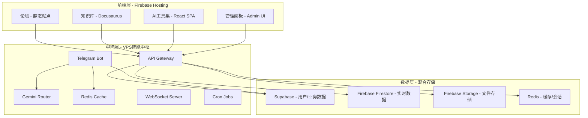

# 🏗️ 完整架构方案 - Firebase + VPS + Supabase

## 📊 当前资源评估

### VPS资源（DigitalOcean SGP1）
```yaml
规格:
  CPU: 2核 (Intel Xeon)
  内存: 7.9GB (实际可用7.5GB)
  存储: 157GB (使用17GB，剩余140GB)
  带宽: 4TB/月
  位置: 新加坡
  成本: $24/月

当前负载:
  CPU: 平均50-60%使用率
  内存: 32%使用率 (2.5GB/7.9GB)
  存储: 11%使用率
  
评估结果: 
  ✅ 内存充足，可承载更多服务
  ⚠️ CPU略紧张，需要优化
  ✅ 存储空间充足
  ✅ 带宽完全够用
```

### 现有服务
```yaml
运行中:
  - Redis (内存1GB限制)
  - Datadog Agent
  - Telegram Bot (待启动)
  - Docker Engine
  
可用资源:
  - 剩余内存: ~5GB
  - 剩余存储: 140GB
  - 剩余CPU: 需优化后约40-50%
```

---

## 🎯 目标架构设计

### 三层架构模型



---

## 🚀 Firebase火计划集成方案

### 1. Firebase Hosting（静态站点）

```yaml
部署内容:
  论坛:
    技术: Discourse Lite / Flarum Static
    路径: forum.yourdomain.com
    特点: 完全静态化，SEO友好
    
  知识库:
    技术: Docusaurus v3
    路径: docs.yourdomain.com
    特点: Markdown驱动，版本控制
    
  AI工具集:
    技术: React + TailwindCSS
    路径: tools.yourdomain.com
    功能:
      - Prompt生成器
      - 图像生成界面
      - 文本处理工具
      - API测试器
      
  主站:
    技术: Next.js Static Export
    路径: www.yourdomain.com
    
成本: 免费（Spark计划）
  - 10GB存储
  - 360MB/天带宽
  - 自定义域名
```

### 2. Firebase Functions（Serverless后端）

```yaml
用途:
  - 轻量API端点
  - Webhook处理
  - 定时任务
  - 用户认证
  
限制:
  - 125K调用/月（免费）
  - 40K GB-秒/月
  - 40K CPU-秒/月
  
建议: 
  重计算任务转到VPS
  Firebase仅处理轻量请求
```

### 3. Firebase与VPS通信

```javascript
// Firebase Function示例
exports.callVPSAPI = functions.https.onRequest(async (req, res) => {
    // 调用VPS上的API
    const response = await fetch('https://vps.yourdomain.com/api/process', {
        method: 'POST',
        headers: {
            'Authorization': `Bearer ${process.env.VPS_API_KEY}`,
            'Content-Type': 'application/json'
        },
        body: JSON.stringify(req.body)
    });
    
    const data = await response.json();
    res.json(data);
});
```

---

## 🔧 VPS角色定位

### 核心职责

```yaml
1. 智能路由中枢:
   - 25个Gemini API Keys管理
   - 负载均衡
   - 故障转移
   - 限流控制
   
2. Telegram Bot服务:
   - 消息处理
   - 用户管理
   - VIP系统
   - 数据分析
   
3. API网关:
   - 统一入口
   - 认证授权
   - 请求转发
   - 响应缓存
   
4. 实时服务:
   - WebSocket服务器
   - Server-Sent Events
   - 长轮询支持
   
5. 后台任务:
   - 数据同步
   - 定时报告
   - 监控告警
   - 备份任务
```

### VPS服务部署

```bash
# 建议的服务部署结构
/opt/services/
├── telegram-bot/        # Go Bot
├── api-gateway/         # Kong/Traefik
├── gemini-router/       # Key管理服务
├── websocket-server/    # Socket.io
├── cron-jobs/          # 定时任务
└── monitoring/         # Prometheus + Grafana
```

---

## 🗄️ 数据架构 - Supabase + Firebase混合

### 数据分配策略

```yaml
Supabase (PostgreSQL):
  用途: 结构化业务数据
  存储:
    - 用户账户
    - 订单交易
    - 内容管理
    - 分析数据
    - VIP记录
  优势:
    - SQL查询
    - 事务支持
    - 关系型数据
    - Row Level Security

Firebase Firestore:
  用途: 实时协作数据
  存储:
    - 聊天消息
    - 在线状态
    - 实时通知
    - 临时数据
  优势:
    - 实时同步
    - 离线支持
    - 自动扩展
    - 客户端SDK

Redis (VPS):
  用途: 高速缓存
  存储:
    - 会话数据
    - API缓存
    - 计数器
    - 临时锁
  优势:
    - 极速访问
    - 数据过期
    - 发布订阅

Firebase Storage:
  用途: 文件存储
  存储:
    - 用户头像
    - 文档附件
    - 生成的图片
    - 静态资源
  优势:
    - CDN加速
    - 直接上传
    - 访问控制
```

### 数据同步方案

```javascript
// VPS上的同步服务
class DataSyncService {
    constructor() {
        this.supabase = createClient(SUPABASE_URL, SUPABASE_KEY);
        this.firebase = initializeApp(FIREBASE_CONFIG);
        this.redis = new Redis();
    }
    
    // Supabase → Firebase实时同步
    async syncUserStatus(userId) {
        // 从Supabase获取用户数据
        const { data } = await this.supabase
            .from('users')
            .select('*')
            .eq('id', userId)
            .single();
        
        // 同步到Firebase
        await this.firebase
            .firestore()
            .collection('users')
            .doc(userId)
            .set({
                ...data,
                lastSync: new Date()
            });
        
        // 更新Redis缓存
        await this.redis.set(
            `user:${userId}`,
            JSON.stringify(data),
            'EX', 3600
        );
    }
}
```

---

## 🛠️ 部署流程

### 第一阶段：VPS优化（立即执行）

```bash
# 1. CPU优化
systemctl stop unnecessary-services
nice -n 19 telegram-bot

# 2. 内存优化
echo "vm.swappiness=10" >> /etc/sysctl.conf
sysctl -p

# 3. Docker优化
docker system prune -af
docker-compose up -d --scale bot=1

# 4. 启动核心服务
./start_core_services.sh
```

### 第二阶段：Firebase初始化（1天）

```bash
# 1. 安装Firebase CLI
npm install -g firebase-tools

# 2. 初始化项目
firebase init
# 选择: Hosting, Functions, Firestore, Storage

# 3. 部署静态站点
firebase deploy --only hosting

# 4. 部署云函数
firebase deploy --only functions
```

### 第三阶段：连接集成（2-3天）

```yaml
任务列表:
  1. VPS API服务:
     - 创建RESTful API
     - 添加认证中间件
     - 实现CORS配置
     
  2. Firebase Functions:
     - 代理VPS调用
     - 用户认证
     - Webhook处理
     
  3. 数据同步:
     - Supabase Realtime订阅
     - Firebase触发器
     - Redis缓存策略
     
  4. 监控设置:
     - Datadog集成
     - Firebase Analytics
     - 自定义告警
```

---

## 💰 成本分析

### 当前成本
```yaml
DigitalOcean VPS: $24/月
Supabase Free: $0
Firebase Spark: $0
域名: ~$12/年
总计: ~$25/月
```

### 扩展成本（如需要）
```yaml
Firebase Blaze计划: 按用量付费
  - Firestore: $0.18/GB/月
  - Functions: $0.40/百万调用
  - Storage: $0.026/GB/月
  
Supabase Pro: $25/月（如超出免费额度）
  
预估增量: $10-30/月
```

---

## 🔐 安全架构

```yaml
网络安全:
  - Cloudflare CDN保护
  - DDoS防护
  - SSL/TLS加密
  - IP白名单

API安全:
  - JWT认证
  - Rate Limiting
  - API密钥轮换
  - 请求签名

数据安全:
  - 端到端加密
  - Row Level Security
  - 定期备份
  - 审计日志
```

---

## 📝 实施步骤

### Week 1：基础设施
- [ ] VPS服务优化
- [ ] Bot稳定运行
- [ ] API网关部署
- [ ] 监控系统完善

### Week 2：Firebase集成
- [ ] Firebase项目创建
- [ ] 静态站点迁移
- [ ] Functions开发
- [ ] 数据同步测试

### Week 3：前端开发
- [ ] 论坛静态化
- [ ] 知识库搭建
- [ ] AI工具集开发
- [ ] 管理面板

### Week 4：优化调试
- [ ] 性能优化
- [ ] 安全加固
- [ ] 文档完善
- [ ] 用户测试

---

## 🎯 关键决策点

### 1. 是否保留VPS？
**建议：保留** ✅
- 理由：25个Gemini Keys需要管理
- Bot服务需要持续运行
- 复杂计算不适合Serverless

### 2. 主要托管在哪里？
**建议：混合部署** ✅
- 静态内容 → Firebase Hosting
- API/Bot → VPS
- 数据 → Supabase + Firebase

### 3. 是否需要升级VPS？
**建议：暂不需要** ✅
- 先优化现有资源
- 监控实际使用情况
- 按需扩展

---

## 🚀 立即行动

```bash
# 1. 创建Firebase项目
https://console.firebase.google.com/

# 2. 初始化本地环境
cd /mnt/volume_sgp1_01/svs_bot
npm init -y
npm install firebase-tools

# 3. 登录Firebase
npx firebase login --no-localhost

# 4. 初始化配置
npx firebase init

# 5. 测试部署
echo "<h1>Test</h1>" > public/index.html
npx firebase deploy --only hosting
```

---

## 📊 架构优势

1. **成本优化**: 充分利用免费额度
2. **高可用**: 多层冗余，故障转移
3. **可扩展**: 按需扩展，平滑升级
4. **易维护**: 分层架构，职责清晰
5. **性能好**: CDN加速，就近访问

---

**这个架构方案充分利用了Firebase的免费额度，保留了VPS的计算能力，继续使用Supabase数据库，实现了最佳的成本效益比！**
