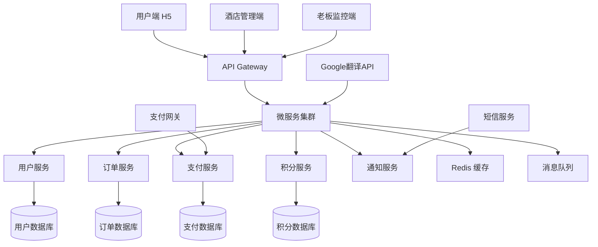

# 🏨 Hotel Inistel - 东南亚酒店管理系统

> 专为东南亚市场设计的现代化酒店管理解决方案生态白皮书

> **创新的东南亚酒店管理解决方案**
>
> 一个集PMS系统、积分生态、金融服务于一体的完整酒店数字化平台


---

## 📋 目录

- [执行摘要](#执行摘要)
- [项目背景与市场定位](#项目背景与市场定位)
- [核心产品架构](#核心产品架构)
- [创新生态系统](#创新生态系统)
- [商业模式](#商业模式)
- [技术架构](#技术架构)
- [SWOT分析](#swot分析)
- [风险评估与应对](#风险评估与应对)
- [发展路线图](#发展路线图)
- [财务预测](#财务预测)
- [快速开始](#快速开始)

---

## 🎯 执行摘要

Hotel Inistel 是一个专为东南亚中小型酒店设计的创新数字化平台，结合了现代PMS系统、积分生态和金融增值服务。通过极低的月费定价和本地化运营，为酒店提供高性价比的数字化转型解决方案。

**核心价值主张：**

- 💰 **极低成本**：月费约等于酒店一天营业额
- 🌍 **本地化运营**：深度理解东南亚市场需求
- 🔄 **创新生态**：积分体系+金融服务+多语言支持
- 📱 **轻量化设计**：H5+云服务，无需复杂部署

---

## 🌏 项目背景与市场定位

### 市场机遇

**目标市场**：东南亚地区（老挝→泰国→区域扩张）

**目标客户**：中小型酒店、旅馆、民宿

**市场痛点**：
- 现有PMS系统价格昂贵（月费通常在500-2000美元）
- 功能复杂，不适合本地市场实际需求
- 缺乏有效的员工监管机制
- 支付和结算流程繁琐，多语言支持不足

### 竞争优势

- 🎯 **精准定价**：极低的月费定价（约等于酒店一天营业额）
- 🚀 **轻量化设计**：功能精简实用，避免功能冗余
- 🌍 **本地化运营**：深度理解并满足东南亚市场需求
- 💎 **创新生态**：独特的积分生态系统，增强用户粘性
- 🔒 **防欺诈机制**：内置员工操作监控，防止私收现金

---

## 🏗️ 核心产品架构

### 三端架构设计

#### 🏨 酒店管理端
- **日历式房态管理**：直观的房间状态可视化
- **订单全生命周期**：待完成/进行中/已完成状态追踪
- **设施维护报告**：问题上报与处理流程
- **财务总账管理**：收入、支出、利润分析
- **多语言支持**：基于Google翻译API的实时翻译

#### 👤 用户端（H5）
- **扫码快速访问**：无需下载APP，扫码即用
- **在线预订支付**：支持多种支付方式
- **任务系统参与**：完成任务获得积分奖励
- **积分查询兑换**：跨酒店积分使用
- **Google账户登录**：一键登录，降低使用门槛

#### 👔 老板监控端
- **多店铺集中管理**：统一管理多个酒店
- **实时收款监控**：防止员工私自收现金
- **员工操作日志**：详细记录所有操作行为
- **数据分析报表**：经营状况一目了然

### 技术特色

- **云原生架构**：Google Cloud Platform全套服务
- **弹性计费**：按需付费，低流量低成本，高并发自动扩容
- **多语言支持**：自动翻译，类似Google Maps评论系统
- **离线能力**：关键功能支持离线操作

---

## 🔄 创新生态系统

### 积分体系设计

#### 核心理念
将现金概念化为积分/代币（1:1兑换），通过积分化降低直接资金往来风险

#### 功能特性
- **跨酒店通用**：积分可在平台内所有酒店使用
- **任务获取机制**：
  - 酒店发布清洁、维护、推广等任务
  - 客人完成任务获得积分奖励
  - 促进客人参与酒店运营
- **多元化兑换**：
  - 兑换住宿服务
  - 兑换餐饮、SPA等增值服务
  - 兑换当地特产、纪念品

#### 生态闭环
```
客人入住 → 完成任务 → 获得积分 → 兑换服务 → 提升满意度 → 重复消费
```

### 双向评价系统

#### 创新点
- **酒店评价客人**：建立客人信用档案，黑名单共享
- **客人评价酒店**：传统评价系统优化
- **多语言互通**：评价内容自动翻译，促进国际客人交流
- **区域信用体系**：逐步建立东南亚酒店业信用网络

### 金融增值服务

#### T+1结算模式
- **资金流转**：客人支付→平台托管24小时→结算给酒店
- **风险控制**：短期持有，降低资金风险
- **增值收益**：为酒店提供1%年化收益

#### 收益来源
- 平台资金存入高息银行账户
- 利息差额作为平台收益来源之一
- 为酒店提供资金增值服务

---

## 💼 商业模式

### 收入结构

#### 主要收入来源
1. **订阅费收入**（40%）
   - 极低月费：约等于酒店一天营业额
   - 规模化后成为稳定收入来源

2. **资金沉淀收益**（35%）
   - T+1结算产生的利息差
   - 随平台交易量增长而增长

3. **平台佣金**（20%）
   - 在线预订抽成（3-5%）
   - 积分兑换服务费

4. **增值服务**（5%）
   - 数据分析报告
   - 营销推广服务
   - 定制化开发

### 推广策略

#### 种子用户计划
- **免费赠送**：20套系统给优质种子用户
- **深度服务**：提供一对一培训和支持
- **口碑传播**：依靠种子用户带动周边酒店

#### 地推策略
- **本地化团队**：招募当地员工，文化契合度高
- **品牌先行**：先推广连锁品牌概念，再推广系统
- **示范效应**：在热门地区建立示范酒店

---

## 📊 SWOT分析

### 优势（Strengths）
- ✅ **行业经验**：创始人具备酒店行业实战经验
- ✅ **技术能力**：强大的技术团队，快速迭代能力
- ✅ **价格优势**：显著低于市场同类产品
- ✅ **本地化**：深度理解东南亚市场文化
- ✅ **轻量设计**：功能精简，易于部署和使用

### 劣势（Weaknesses）
- ❌ **信任门槛**：资金托管模式需要建立信任
- ❌ **团队规模**：初期团队小，扩张能力有限
- ❌ **品牌知名度**：新品牌，市场认知度低
- ❌ **资金需求**：需要一定资金支持初期运营
- ❌ **生态培育**：积分系统需要时间和耐心培育

### 机会（Opportunities）
- 🎯 **市场空白**：东南亚中小酒店数字化程度低
- 🎯 **成本敏感**：目标客户对性价比极度敏感
- 🎯 **经济增长**：区域经济发展带动旅游业增长
- 🎯 **数字化趋势**：疫情加速了酒店业数字化需求
- 🎯 **跨境机会**：可拓展至跨境电商、金融服务

### 威胁（Threats）
- ⚠️ **大厂竞争**：国际大型PMS厂商可能降价竞争
- ⚠️ **监管风险**：各国金融、数据监管政策差异
- ⚠️ **汇率风险**：多国运营面临汇率波动
- ⚠️ **安全风险**：网络安全和数据隐私要求严格
- ⚠️ **模仿风险**：商业模式相对简单，容易被模仿

---

## 💰 财务预测

### 市场规模估算

#### 目标市场分析
- **老挝市场**：约200家中小型酒店
- **泰国市场**：约2000家中小型酒店  
- **东南亚区域**：约15000家中小型酒店

#### 渗透率预测
- **第1年**：老挝市场10%渗透率（20家酒店）
- **第2年**：老挝市场50% + 泰国市场5%（100 + 100 = 200家）
- **第3年**：区域市场2%渗透率（300家酒店）

### 收入预测模型

#### 基础假设
- 平均月费：$50/酒店
- 平均月交易额：$3000/酒店
- 资金沉淀收益率：3%年化
- 平台佣金率：4%

#### 3年收入预测

| 年份 | 酒店数量 | 订阅收入 | 交易佣金 | 资金收益 | 总收入 |
|-----|---------|---------|---------|---------|-------|
| Y1  | 20      | $12K    | $2.9K   | $1.8K   | $16.7K |
| Y2  | 200     | $120K   | $28.8K  | $18K    | $166.8K |
| Y3  | 300     | $180K   | $43.2K  | $27K    | $250.2K |

### 成本结构

#### 运营成本
- **技术开发**：30% - 持续功能迭代和系统维护
- **市场推广**：25% - 地推团队和营销活动
- **客户服务**：20% - 本地化支持团队
- **基础设施**：15% - 云服务和第三方接口
- **管理费用**：10% - 行政和法务成本

#### 盈亏平衡分析
- **盈亏平衡点**：约150家酒店
- **预计实现时间**：第2年第1季度
- **净利润率目标**：25-30%

---

## ⚠️ 风险评估与应对

### 主要风险识别

#### 1. 信任风险 (高)
**风险描述**：酒店老板对资金托管模式存疑

**应对策略**：
- 引入第三方银行担保
- 提供保险保障
- 透明化资金流向
- 建立信用评级体系

#### 2. 技术风险 (中)
**风险描述**：系统稳定性和安全性挑战

**应对策略**：
- 采用Google Cloud成熟基础设施
- 建立多重备份和容灾机制
- 定期安全审计和渗透测试
- 购买技术责任保险

#### 3. 市场风险 (中)
**风险描述**：用户接受度和竞争加剧

**应对策略**：
- 深度调研和小规模试点
- 差异化定位和产品创新
- 建立用户社区和生态护城河
- 灵活的定价和产品策略

#### 4. 监管风险 (高)
**风险描述**：各国金融和数据监管政策变化

**应对策略**：
- 聘请当地法律顾问
- 建立合规管理体系
- 与监管部门保持沟通
- 准备多套合规方案

#### 5. 汇率风险 (中)
**风险描述**：多国运营面临汇率波动

**应对策略**：
- 采用对冲工具降低风险
- 本地化收付款结算
- 建立汇率波动准备金
- 多元化收入来源

---

## 🗺️ 发展路线图

### 第一阶段：MVP验证 (0-6个月)

#### 核心目标
- 完成MVP产品开发和测试
- 老挝市场20家种子酒店试点
- 验证商业模式可行性

#### 关键里程碑
- [ ] 完成三端产品开发（酒店端、用户端、老板端）
- [ ] 获得20家种子酒店签约
- [ ] 实现基础PMS功能稳定运行
- [ ] 建立初步积分生态系统
- [ ] 收集用户反馈并快速迭代

#### 预期成果
- 产品功能验证完成
- 获得初始用户认可
- 建立基础运营团队

### 第二阶段：市场扩张 (6-18个月)

#### 核心目标
- 老挝市场深度渗透
- 完善产品功能和生态
- 准备进入泰国市场

#### 关键里程碑
- [ ] 老挝市场达到100家酒店
- [ ] 完善金融服务功能
- [ ] 建立本地化运营团队
- [ ] 获得A轮融资
- [ ] 泰国市场调研和准备

#### 预期成果
- 建立稳定收入来源
- 完善产品和服务体系
- 获得市场认可和品牌影响力

### 第三阶段：区域化发展 (18-36个月)

#### 核心目标
- 进入泰国等核心市场
- 平台化运营和生态完善
- 探索新业务模式

#### 关键里程碑
- [ ] 泰国市场获得100家酒店
- [ ] 平台总计300家酒店
- [ ] 完善跨境金融服务
- [ ] 探索B2B2C模式
- [ ] 建立区域品牌影响力

#### 预期成果
- 成为区域领先的酒店数字化平台
- 建立稳定的盈利模式
- 具备进一步扩张的基础

---

## 🏗️ 技术架构

### 系统架构图



### 技术选型

#### 前端技术栈
- **H5应用**：React + TypeScript + PWA
- **管理端**：React + Material-UI + Redux
- **响应式设计**：支持移动端和桌面端
- **离线能力**：Service Worker + IndexedDB

#### 后端技术栈
- **API服务**：Node.js + Express + TypeScript
- **数据库**：PostgreSQL + Redis
- **消息队列**：Google Pub/Sub
- **文件存储**：Google Cloud Storage

#### 云服务架构
- **计算平台**：Google Cloud Run (无服务器)
- **数据库**：Google Cloud SQL + Memorystore
- **监控日志**：Google Cloud Logging + Monitoring
- **CDN加速**：Google Cloud CDN

#### 安全和合规
- **身份认证**：OAuth 2.0 + JWT
- **数据加密**：TLS 1.3 + AES-256
- **访问控制**：RBAC权限模型
- **合规性**：GDPR + 当地数据保护法规

---

## ✨ 功能特性

### 🏨 核心功能
- **用户认证** - 安全的登录系统
- **仪表板** - 实时统计数据和关键指标
- **房间管理** - 房间状态、类型、价格管理
- **预订管理** - 预订创建、状态跟踪、入住退房
- **客户管理** - 客户信息、历史记录、会员等级

### 🎨 界面特性
- 响应式设计，支持移动端
- Material-UI 现代化界面
- 中文本地化
- 直观的用户体验

### 🛠️ 技术特性
- React 18 + Material-UI
- Firebase 集成准备
- Docker 容器化支持
- 模块化组件设计

## 🚀 快速开始

### 前置要求
- Node.js 16+
- npm 或 yarn
- Docker (可选)

### 本地开发

```bash
# 克隆项目
git clone https://github.com/svsbeta/hotel-inistel.git
cd hotel-inistel

# 安装依赖
npm install

# 启动开发服务器
npm start
```

应用将在 `http://localhost:3000` 启动。

### 演示登录
- 邮箱: `admin@hotel.com`
- 密码: `admin123`

### Docker 部署

```bash
# 构建镜像
docker build -t hotel-inistel .

# 运行容器
docker run -p 3000:3000 hotel-inistel

# 或使用 docker-compose
docker-compose up
```

## 📁 项目结构

```
hotel-inistel/
├── public/                 # 静态文件
├── src/
│   ├── components/         # React 组件
│   │   └── Navigation.js   # 导航组件
│   ├── pages/             # 页面组件
│   │   ├── Dashboard.js   # 仪表板
│   │   ├── Rooms.js       # 房间管理
│   │   ├── Bookings.js    # 预订管理
│   │   ├── Customers.js   # 客户管理
│   │   └── Login.js       # 登录页面
│   ├── services/          # 服务层
│   │   └── firebase.js    # Firebase 配置
│   ├── App.js             # 主应用组件
│   └── index.js           # 应用入口
├── docker-compose.yml     # Docker 编排
├── Dockerfile            # Docker 镜像
├── firebase.json         # Firebase 配置
└── package.json          # 项目依赖
```

## 🏗️ 系统架构

### 技术栈
- **前端**: React 18, Material-UI, React Router
- **后端**: Firebase (Authentication, Firestore, Hosting)
- **部署**: Google Cloud Run, Firebase Hosting
- **开发**: Docker, npm scripts

### 数据模型
- **用户 (Users)**: 认证信息、角色权限
- **房间 (Rooms)**: 房间信息、状态、价格
- **预订 (Bookings)**: 预订记录、状态跟踪
- **客户 (Customers)**: 客户档案、会员等级

## 🔧 开发说明

### 可用脚本
```bash
npm start      # 启动开发服务器
npm build      # 构建生产版本
npm test       # 运行测试
```

### Firebase 配置
1. 在 Firebase Console 创建项目
2. 更新 `src/services/firebase.js` 中的配置
3. 设置 Firestore 安全规则
4. 配置 Authentication 提供商

### 环境变量
创建 `.env` 文件：
```env
REACT_APP_FIREBASE_API_KEY=your-api-key
REACT_APP_FIREBASE_AUTH_DOMAIN=your-domain
REACT_APP_FIREBASE_PROJECT_ID=your-project-id
```

## 📈 roadmap

### 阶段1: 基础功能 ✅
- [x] 项目脚手架
- [x] 用户界面设计
- [x] 基础 CRUD 操作
- [x] 响应式布局

### 阶段2: 数据集成 (进行中)
- [ ] Firebase 集成
- [ ] 实时数据同步
- [ ] 用户认证系统
- [ ] 数据持久化

### 阶段3: 高级功能
- [ ] 报表分析
- [ ] 支付集成
- [ ] 消息通知
- [ ] API 接口

### 阶段4: 部署优化
- [ ] 生产环境部署
- [ ] 性能优化
- [ ] 监控告警
- [ ] 用户文档

## 🤝 贡献指南

1. Fork 项目
2. 创建功能分支 (`git checkout -b feature/AmazingFeature`)
3. 提交更改 (`git commit -m 'Add some AmazingFeature'`)
4. 推送到分支 (`git push origin feature/AmazingFeature`)
5. 打开 Pull Request

## 📄 许可证

本项目采用 MIT 许可证 - 查看 [LICENSE](LICENSE) 文件了解详情。

## 🆘 支持

如有问题或建议，请：
- 提交 [Issue](https://github.com/svsbeta/hotel-inistel/issues)
- 联系项目维护者

## 🙏 致谢

- [React](https://reactjs.org/) - UI 框架
- [Material-UI](https://mui.com/) - 组件库
- [Firebase](https://firebase.google.com/) - 后端服务
- [Google Cloud](https://cloud.google.com/) - 云平台
