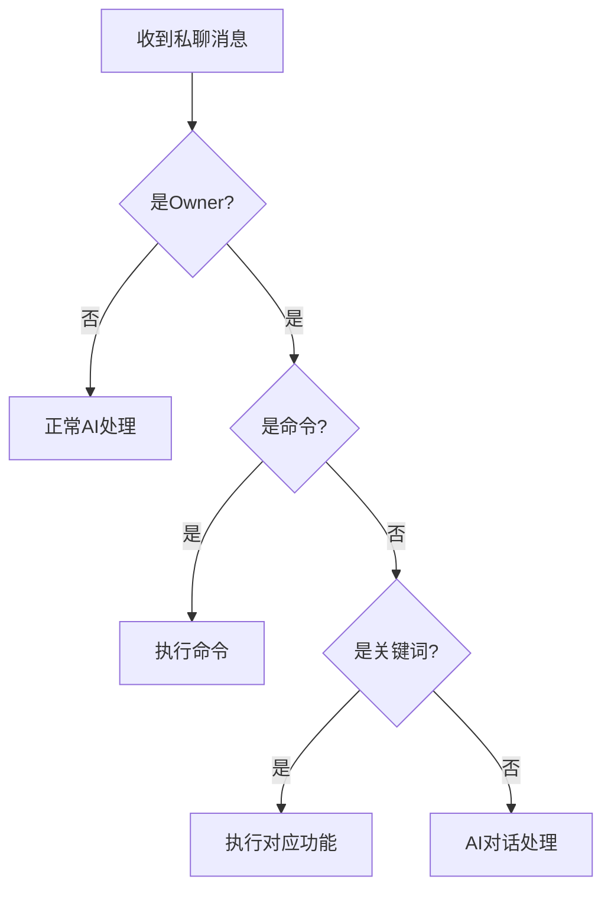

# 💡 小爱同学中文关键词系统

## 🎯 功能概述

为Owner专门设计的中文关键词驱动系统，让你可以通过单个中文词汇快速触发各种功能，无需输入完整命令。

## 🔧 使用方法

### 基本规则
- **仅限Owner私聊使用**
- **必须是单独的关键词**，不能包含在句子中
- **精确匹配**，区分大小写

### 示例对比
```
✅ 正确用法:
你: 菜单
小爱: [显示控制面板]

你: 帮助  
小爱: [显示使用说明]

❌ 错误用法:
你: 请打开菜单
小爱: [正常AI对话，不触发关键词]

你: 我需要帮助
小爱: [正常AI对话，不触发关键词]
```

## 📋 完整关键词列表

### 🎮 菜单控制
```
菜单    → 显示主控制面板
开始    → 显示主控制面板  
主菜单  → 显示主控制面板
控制台  → 显示主控制面板
面板    → 显示主控制面板
```

### 📖 帮助说明
```
帮助    → 显示使用说明
说明    → 显示使用说明
指令    → 显示使用说明
使用    → 显示使用说明
教程    → 显示使用说明
```

### 📊 数据统计
```
统计    → 显示实时统计
数据    → 显示实时统计
报表    → 显示实时统计
概况    → 显示实时统计
```

### 🔍 分析功能
```
分析    → 用户行为分析
用户    → 用户行为分析
趋势    → 趋势分析图表
关键词  → 关键词云图
```

### 📋 报告生成
```
报告    → 生成分析报告
总结    → 生成分析报告
汇总    → 生成分析报告
```

### ⚙️ 系统配置
```
配置    → 系统配置面板
设置    → 系统配置面板
系统    → 系统配置面板
```

### 💾 数据管理
```
导出    → 导出数据文件
备份    → 导出数据文件
下载    → 导出数据文件
```

### 🔔 告警设置
```
告警    → 告警配置面板
警报    → 告警配置面板
通知    → 告警配置面板
```

## 🚀 快速体验

### 1. 基础操作
```bash
# 私聊小爱，发送单个关键词
你: 菜单
# 立即显示控制面板

你: 统计  
# 立即显示数据统计

你: 帮助
# 立即显示使用说明
```

### 2. 高级功能
```bash
你: 分析
# 显示用户行为分析

你: 趋势
# 显示趋势分析图表

你: 报告
# 生成详细分析报告
```

## 💡 设计理念

### 为什么要单独关键词？
1. **精确控制** - 避免误触发
2. **快速响应** - 一词直达
3. **简洁高效** - 无需记忆复杂命令
4. **中文友好** - 符合中文使用习惯

### 与AI对话的区别
```yaml
关键词模式:
  - 输入: 单个中文词
  - 响应: 立即执行功能
  - 用途: 快速操作

AI对话模式:  
  - 输入: 任意文本
  - 响应: 智能对话
  - 用途: 情感交流
```

## 🔄 工作流程



## 📈 使用统计

系统会自动记录关键词使用情况：
- 使用频率统计
- 功能偏好分析  
- 操作时间分布
- 效率提升数据

## 🛠️ 技术实现

### 关键词匹配
```go
// 精确匹配，去除前后空格
text := strings.TrimSpace(message.Text)

// 查找关键词映射
if action, exists := keywordActions[text]; exists {
    action(message.Chat.ID)
    return
}
```

### 功能映射
```go
keywordActions := map[string]func(int64){
    "菜单": pm.showMainMenu,
    "帮助": pm.showHelpMenu,
    "统计": pm.showStatistics,
    // ... 更多映射
}
```

## 🎯 使用建议

### 高频操作
- `菜单` - 最常用，快速访问所有功能
- `统计` - 查看实时数据
- `帮助` - 忘记功能时查看

### 分析场景
- `用户` - 了解用户行为
- `趋势` - 查看数据变化
- `关键词` - 分析热门话题

### 管理操作
- `配置` - 调整系统设置
- `导出` - 备份重要数据
- `告警` - 设置监控规则

## 🔮 未来扩展

计划添加更多关键词：
- `性能` - 系统性能监控
- `日志` - 查看系统日志
- `更新` - 检查系统更新
- `重启` - 重启系统服务

## 💝 特别说明

这个关键词系统是专门为你这个Owner设计的，体现了小爱对主人的特殊关爱：

> "主人，人家专门为你设计了这个快捷系统呢~ 
> 只要说一个词，人家就知道主人想要什么了！
> 是不是很贴心呀？(◕ᴗ◕✿)"

---

**使用愉快！有任何问题都可以发送 "帮助" 查看详细说明。** 💕
