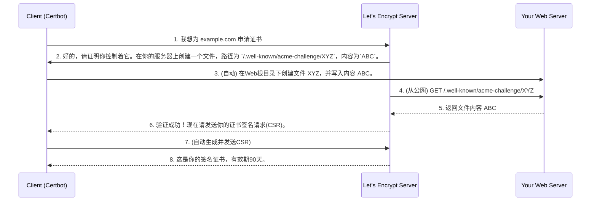

# 04.5 SSL证书终极指南：Let's Encrypt与Certbot自动化实战

**作者**:Cline | **发布日期**: 2025-11-24 | **更新日期**: 2025-10-25 | **分类**: `云端基建` `SSL` `网络安全` `DevOps` `Certbot`

**摘要**: 在今天的互联网环境中，HTTPS不再是“推荐选项”，而是关乎安全、信任和SEO排名的“强制要求”。然而，传统SSL证书的昂贵价格和繁琐的手动续期流程，曾是许多开发者的噩梦。直到Let's Encrypt的出现，它通过提供免费、开放、自动化的证书颁发服务，彻底改变了这一切。本篇终极指南将深入解析Let's Encrypt的工作原理，并手把手教你使用其最流行的客户端`certbot`，为你的Web服务器实现“一劳永逸”的SSL证书自动签发与续期，并覆盖Docker环境下的高级应用。

**SEO关键词**: SSL证书, Let's Encrypt, Certbot教程, HTTPS, 自动续期, 通配符证书, Nginx SSL, Docker Certbot

---

## 第1部分：SSL/TLS与Let's Encrypt简介

### 1.1 什么是SSL/TLS？

SSL（安全套接层）及其后继者TLS（传输层安全），是一种加密协议，用于在用户的浏览器和你的Web服务器之间建立一条加密通道，确保数据传输过程中的**机密性**（不被窃听）和**完整性**（不被篡改）。

### 1.2 ACME协议工作原理：HTTP-01挑战可视化

Let's Encrypt通过ACME协议（自动化证书管理环境）来自动验证域名所有权。最常用的HTTP-01挑战，其流程如下：



---

## 第2部分：Certbot安装与一键开启HTTPS

`certbot`是EFF（电子前哨基金会）维护的最流行的ACME客户端。

### 2.1 多平台安装指南

- **Ubuntu/Debian (推荐)**: 使用`snap`包管理器。
  ```bash
  sudo apt-get update
  sudo apt-get install snapd
  sudo snap install --classic certbot
  sudo ln -s /snap/bin/certbot /usr/bin/certbot
  ```
- **CentOS/RHEL**:
  ```bash
  sudo dnf install epel-release
  sudo dnf install certbot python3-certbot-nginx
  ```
- **在Docker中运行**: 如果你不想污染主机环境，可以直接使用Docker运行Certbot。
  ```bash
  docker run -it --rm --name certbot \
    -v "/etc/letsencrypt:/etc/letsencrypt" \
    -v "/var/lib/letsencrypt:/var/lib/letsencrypt" \
    certbot/certbot certonly
  ```

### 2.2 Nginx的“魔法”命令与原理解析

**命令**: `sudo certbot --nginx`

**背后发生的事**: 
1.  **解析配置**: Certbot扫描`/etc/nginx/sites-enabled/`下的所有配置文件，找出所有的`server_name`。
2.  **选择域名**: 询问你为哪个域名申请证书。
3.  **自动修改Nginx配置 (第一次)**: Certbot会临时在你的Nginx配置文件中，为`.well-known/acme-challenge`这个路径添加一个`location`块，使其指向一个临时目录，以便响应Let's Encrypt的HTTP-01验证请求。
4.  **获取证书**: 验证成功后，获取证书并保存在`/etc/letsencrypt/live/<你的域名>/`。
5.  **再次自动修改Nginx配置 (第二次)**: Certbot会**重写**你的Nginx配置文件，将`listen 80`的`server`块，修改为重定向到HTTPS，并创建一个完整的`listen 443 ssl`的`server`块，其中包含了所有推荐的SSL配置。

**配置变化对比**:
- **修改前 (`/etc/nginx/sites-available/default`)**:
  ```nginx
  server {
      listen 80;
      server_name example.com;
      root /var/www/html;
  }
  ```
- **修改后 (`certbot --nginx`自动生成)**:
  ```nginx
  server {
      listen 80;
      server_name example.com;
      # 自动添加了301重定向
      return 301 https://$host$request_uri;
  }
  server {
      listen 443 ssl;
      server_name example.com;
      root /var/www/html;

      # 自动添加了证书路径
      ssl_certificate /etc/letsencrypt/live/example.com/fullchain.pem;
      ssl_certificate_key /etc/letsencrypt/live/example.com/privkey.pem;
      # 自动包含了推荐的SSL参数
      include /etc/letsencrypt/options-ssl-nginx.conf;
      ssl_dhparam /etc/letsencrypt/ssl-dhparams.pem;
  }
  ```

---

## 第3部分：自动续期与钩子 (Hooks)

Let's Encrypt证书有效期为90天，自动化续期是其精髓。

### 3.1 自动续期定时任务

安装Certbot后，它会自动创建一个`systemd timer`或`cron job`，每天运行两次`certbot renew`命令。该命令会检查所有证书，并只对有效期不足30天的证书进行续期。

- **测试自动续期**: `sudo certbot renew --dry-run`。如果成功，则无需任何操作。

### 3.2 续期钩子 (Renewal Hooks)

证书续期成功后，Web服务器（如Nginx）需要重新加载配置才能使用新证书。`--post-hook`参数可以实现这一点。

- **手动续期并重载Nginx**: 
  ```bash
  sudo certbot renew --post-hook "systemctl reload nginx"
  ```
- **永久性配置 (推荐)**: 直接修改证书的续期配置文件，一劳永逸。
  - 打开`/etc/letsencrypt/renewal/your-domain.com.conf`。
  - 在`[renewalparams]`部分，添加或修改`post_hook`：
    ```ini
    [renewalparams]
    ...
    post_hook = systemctl reload nginx
    ```

---

## 第4部分：通配符证书与DNS-01挑战

申请`*.example.com`这样的通配符证书，必须使用DNS-01挑战。

### 4.1 使用DNS插件 (以AWS Route 53为例)

1.  **安装Route 53插件**: `sudo snap install certbot-dns-route53`
2.  **配置AWS IAM**: 创建一个拥有`route53:ChangeResourceRecordSets`和`route53:ListHostedZones`权限的IAM用户，并获取其`Access Key ID`和`Secret Access Key`。
3.  **配置AWS CLI**: 在运行Certbot的机器上，安装并配置AWS CLI (`aws configure`)。
4.  **申请证书**: 
    ```bash
    sudo certbot certonly \
      --dns-route53 \
      -d example.com -d '*.example.com'
    ```
    Certbot会自动使用配置好的AWS凭证，通过API去Route 53上创建和删除TXT记录来完成验证。

### 4.2 手动DNS挑战

如果你的DNS提供商没有Certbot插件，可以选择手动模式。
```bash
sudo certbot certonly --manual --preferred-challenges dns -d example.com
```
Certbot会显示一个TXT记录的名称和值，然后暂停。你需要登录到你的DNS提供商后台，手动添加这条记录。添加完成后，再回到终端按Enter，Certbot会去验证记录并完成签发。

---

## 第5部分：Nginx终极SSL安全配置

要获得Qualys SSL Labs的“A+”评级，你需要一个更强的Nginx配置。

1.  **生成更强的DH参数**: 
    ```bash
    sudo openssl dhparam -out /etc/nginx/dhparam.pem 4096
    ```
2.  **Nginx配置模板**:
    ```nginx
    server {
        listen 443 ssl http2;
        server_name example.com;

        # 证书
        ssl_certificate /etc/letsencrypt/live/example.com/fullchain.pem;
        ssl_certificate_key /etc/letsencrypt/live/example.com/privkey.pem;

        # 安全协议与加密套件
        ssl_protocols TLSv1.2 TLSv1.3;
        ssl_ciphers 'ECDHE-ECDSA-AES128-GCM-SHA256:ECDHE-RSA-AES128-GCM-SHA256:ECDHE-ECDSA-AES256-GCM-SHA384:ECDHE-RSA-AES256-GCM-SHA384:ECDHE-ECDSA-CHACHA20-POLY1305:ECDHE-RSA-CHACHA20-POLY1305:DHE-RSA-AES128-GCM-SHA256:DHE-RSA-AES256-GCM-SHA384';
        ssl_prefer_server_ciphers off;

        # DH参数
        ssl_dhparam /etc/nginx/dhparam.pem;

        # OCSP Stapling (提升TLS握手性能)
        ssl_stapling on;
        ssl_stapling_verify on;
        ssl_trusted_certificate /etc/letsencrypt/live/example.com/chain.pem;

        # HSTS (强制浏览器使用HTTPS)
        add_header Strict-Transport-Security "max-age=63072000; includeSubDomains; preload" always;

        # ... 你的其他location配置 ...
    }
    ```

---

## 第6部分：在Docker Compose中自动化证书管理

这是一个常见的、但更复杂的场景。

- **挑战**: Certbot容器需要响应HTTP-01挑战，这意味着它需要能被公网访问。同时，它生成的证书需要被Nginx容器使用。
- **解决方案**: 使用共享卷。

**`docker-compose.yml`示例**:
```yaml
version: '3.8'
services:
  nginx:
    image: nginx:1.25-alpine
    ports:
      - "80:80"
      - "443:443"
    volumes:
      - ./nginx/conf.d:/etc/nginx/conf.d:ro
      - ./data/letsencrypt:/etc/letsencrypt:ro # 挂载证书目录 (只读)
      - ./data/www:/var/www/html # 挂载Web根目录
    depends_on:
      - web_app

  web_app:
    image: my-app
    # ...

  # Certbot服务，用于申请和续期证书
  certbot:
    image: certbot/certbot
    volumes:
      - ./data/letsencrypt:/etc/letsencrypt
      - ./data/www:/var/www/html # 挂载Web根目录以进行HTTP-01验证
    # 启动时执行申请命令
    command: certonly --webroot -w /var/www/html --email your-email@example.com -d example.com --agree-tos --no-eff-email -n
```

**续期流程**: 你不能将`certbot`作为一个长期运行的服务。正确的做法是，在**主机**上设置一个`cron`定时任务，定期执行`docker-compose run --rm certbot renew`来触发续期检查。

## 结论

Let's Encrypt与Certbot的组合，是现代Web基础设施的基石之一。它将曾经复杂且昂贵的HTTPS部署，变成了一项可以完全自动化、“一次配置，永远运行”的简单任务。通过掌握Certbot的Web服务器插件、DNS插件、续期钩子，以及在Docker环境下的应用，你就能为你所有的项目都配备上免费、可靠、自动续期的安全保障，彻底告别“证书过期”的焦虑。

## 参考资料

1.  [Let's Encrypt 官方网站](https://letsencrypt.org/)
2.  [Certbot 官方网站](https://certbot.eff.org/)
3.  [Qualys SSL Labs (SSL配置在线测试)](https://www.ssllabs.com/ssltest/)
4.  [Mozilla SSL Configuration Generator](https://ssl-config.mozilla.org/)