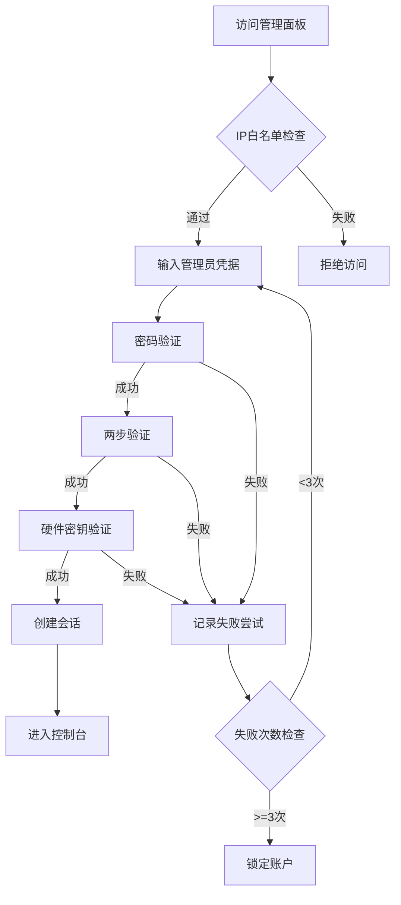
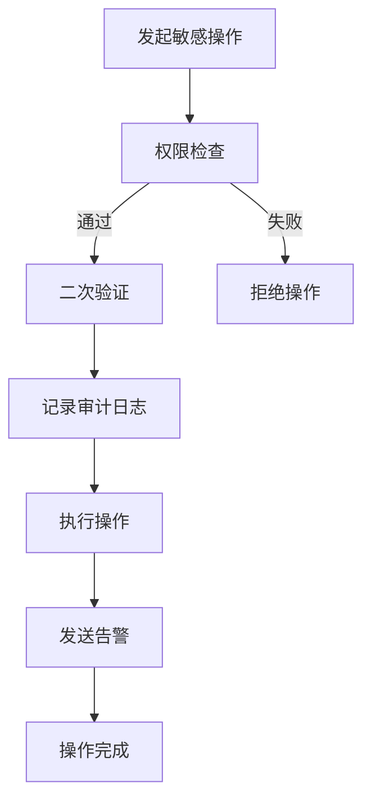

# 管理面板安全架构文档

## 🛡️ 核心安全特性

### 1. 多层认证体系
- **管理员令牌验证** - 主密码认证
- **两步验证(2FA)** - TOTP动态码
- **硬件密钥支持** - U2F/FIDO2
- **IP白名单** - 仅允许特定IP访问
- **会话管理** - 30分钟自动超时

### 2. 实时监控系统

#### 系统状态监控
```javascript
- CPU使用率实时监控
- 内存使用追踪
- 磁盘空间监控
- 网络带宽统计
- 服务健康状态
```

#### 安全事件监控
```javascript
- 登录尝试追踪
- 可疑活动检测
- 暴力破解防护
- SQL注入检测
- API滥用监控
```

### 3. 审计日志系统

所有管理员操作都会被记录：

| 字段 | 说明 |
|------|------|
| timestamp | 操作时间戳 |
| adminId | 管理员ID |
| action | 操作类型 |
| target | 操作目标 |
| ip | 来源IP |
| details | 详细信息 |
| success | 是否成功 |

### 4. 访问控制

#### 角色权限
- **super_admin** - 完全控制权
- **admin** - 常规管理权限
- **moderator** - 内容管理权限
- **viewer** - 只读权限

#### 敏感操作保护
- 用户删除需要二次确认
- 系统配置修改需要super_admin权限
- 数据库操作需要硬件密钥验证
- 批量操作有数量限制

### 5. 防护机制

#### 速率限制
- 每分钟最多100个请求
- 超限自动封禁15分钟
- 渐进式惩罚机制

#### 失败尝试保护
- 3次失败后锁定账户
- 需要super_admin解锁
- 失败记录永久保存

#### 黑名单系统
- 自动检测恶意IP
- 永久封禁机制
- 支持CIDR范围封禁

### 6. 安全响应头

```http
X-Frame-Options: DENY
X-Content-Type-Options: nosniff
X-XSS-Protection: 1; mode=block
Referrer-Policy: strict-origin-when-cross-origin
Content-Security-Policy: default-src 'self'
```

## 📊 监控指标

### 实时指标
- 在线用户数
- 今日请求数
- 威胁检测数
- 系统健康度
- 服务器负载
- 内存使用率
- 磁盘使用率
- 网络带宽

### 安全指标
- 登录成功率
- 威胁拦截率
- 平均响应时间
- 错误率统计

## 🚨 告警机制

### 告警级别
- **LOW** - 常规操作记录
- **MEDIUM** - 需要关注的事件
- **HIGH** - 安全威胁事件
- **CRITICAL** - 紧急安全事件

### 告警渠道
- 控制台日志
- 邮件通知
- 短信告警
- Webhook推送
- Discord/Slack集成

## 🔐 安全最佳实践

### 1. 定期安全审计
- 每周审查登录日志
- 每月检查权限设置
- 季度安全评估
- 年度渗透测试

### 2. 备份策略
- 每日自动备份
- 异地备份存储
- 备份加密存储
- 定期恢复演练

### 3. 应急响应
- 紧急锁定按钮
- 一键封禁IP
- 批量用户禁用
- 系统维护模式

### 4. 密钥管理
- 定期轮换密钥
- 密钥加密存储
- 密钥使用审计
- 密钥泄露检测

## 📝 操作流程

### 登录流程


### 敏感操作流程


## 🛠️ 技术实现

### 使用技术栈
- **Next.js 14** - 框架
- **JWT** - 令牌认证
- **bcrypt** - 密码加密
- **TOTP** - 两步验证
- **WebSocket** - 实时监控
- **PostgreSQL** - 数据存储
- **Redis** - 会话缓存

### 安全依赖
```json
{
  "jsonwebtoken": "^9.0.2",
  "bcryptjs": "^2.4.3",
  "speakeasy": "^2.0.0",  // TOTP
  "helmet": "^7.0.0",      // 安全头
  "express-rate-limit": "^6.0.0",
  "express-session": "^1.17.3",
  "connect-redis": "^7.0.0"
}
```

## 📋 检查清单

### 部署前检查
- [ ] 修改所有默认密码
- [ ] 配置真实的JWT密钥
- [ ] 设置IP白名单
- [ ] 启用HTTPS
- [ ] 配置备份策略
- [ ] 测试告警系统
- [ ] 审查所有权限
- [ ] 启用日志记录

### 日常维护
- [ ] 每日检查安全日志
- [ ] 每周审查失败尝试
- [ ] 每月更新密钥
- [ ] 定期安全培训
- [ ] 应急响应演练

## 🚀 快速部署

```bash
# 1. 设置环境变量
cp .env.example .env.production
# 编辑 .env.production 设置安全密钥

# 2. 初始化数据库
npm run db:admin:init

# 3. 创建超级管理员
npm run admin:create-super

# 4. 启动服务
npm run start:admin

# 5. 访问面板
https://admin.oece.tech
```

## ⚠️ 安全提醒

1. **永远不要**在生产环境使用默认密码
2. **必须启用**HTTPS和安全头
3. **定期更新**所有依赖包
4. **严格控制**管理员权限
5. **实时监控**所有异常活动
6. **定期备份**所有重要数据
7. **制定并演练**应急响应计划

## 📞 紧急联系

- 安全团队: security@oece.tech
- 24/7热线: +1-xxx-xxx-xxxx
- 紧急响应: emergency@oece.tech

---

**最后更新**: 2024-01-20
**版本**: v1.0.0
**状态**: 生产就绪
