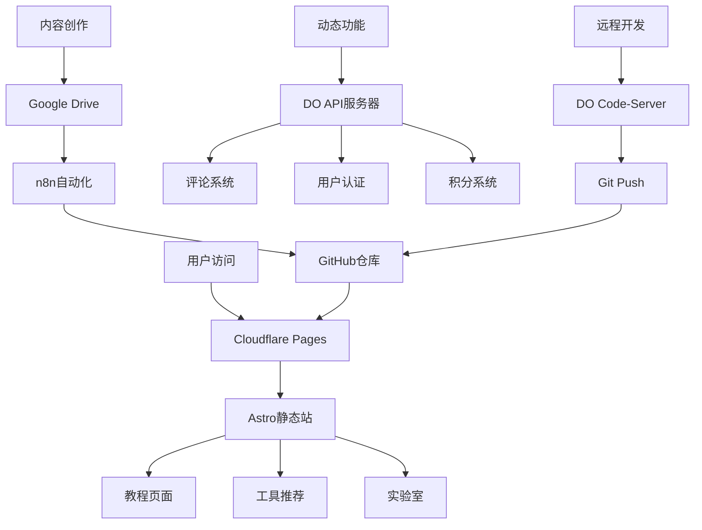

# GeekSEA 完整重构指南 + DO远程开发环境

📅 创建日期：2024-10-19
🎯 目标：从论坛架构转型为教程平台 + DO作为远程开发机
⏰ 预计时间：3-5天完成MVP
💰 成本：$0（全用现有资源）

## 📊 现状分析

### 你目前有什么
✅ GitHub仓库：web3-ai-game/tech-room
✅ 论坛式结构（半成品）
✅ DO VPS：2GB RAM / 2 vCPU（闲置中）
✅ Windsurf：100点数
✅ Google AI Pro：Jules + Gemini
✅ Drive 2TB + OneDrive 1TB

### 你需要什么
1. 清晰的教程站架构（非论坛）
2. 远程开发环境（释放本地内存）
3. AI代理友好的工作流
4. 可持续的内容生产流程

## 🎯 Part 1: 项目重构方案

### 1.1 架构决策

#### 从 Discourse/Flarum 转到 Astro

**为什么放弃论坛系统？**

❌ 论坛的问题：
- 太重（PHP + MySQL吃资源）
- 不适合教程展示（讨论>内容）
- SEO不友好（动态页面）
- 维护成本高（更新/插件）

✅ Astro的优势：
- 超快（静态生成）
- SEO完美（每页独立HTML）
- 灵活（可嵌入React组件）
- 部署免费（Cloudflare Pages）
- AI代理友好（Markdown内容）

### 新架构蓝图



### 1.2 文件结构重构

#### 新建Astro项目结构

```
tech-room/
├── .github/
│   └── workflows/
│       ├── deploy.yml                 # Cloudflare Pages自动部署
│       └── sync-from-drive.yml        # 定期同步Drive内容
│
├── public/
│   ├── images/                        # 图片资源
│   ├── fonts/                         # 字体
│   └── favicon.svg
│
├── src/
│   ├── assets/                        # 需要处理的资源
│   │   ├── styles/
│   │   │   ├── global.css
│   │   │   └── markdown.css           # 教程样式
│   │   └── icons/
│   │
│   ├── components/
│   │   ├── Header.astro               # 导航栏
│   │   ├── Footer.astro
│   │   ├── TutorialCard.astro         # 教程卡片
│   │   ├── TOC.astro                  # 目录
│   │   ├── AffiliateBox.astro         # 联盟推荐
│   │   ├── CodeBlock.astro            # 代码高亮
│   │   ├── PaywallGate.astro          # 付费墙
│   │   ├── LanguageSwitch.astro       # 语言切换
│   │   └── SearchBar.astro            # 搜索框
│   │
│   ├── content/
│   │   ├── config.ts                  # Content Collections配置
│   │   │
│   │   ├── tutorials/                 # 教程内容
│   │   │   ├── zh-TW/                 # 繁体中文
│   │   │   │   ├── vps/
│   │   │   │   │   ├── do-setup.md
│   │   │   │   │   ├── nginx-config.md
│   │   │   │   │   └── ssl-cert.md
│   │   │   │   ├── domain/
│   │   │   │   ├── payment/
│   │   │   │   └── tools/
│   │   │   │
│   │   │   └── en/                    # 英文
│   │   │       └── [同上结构]
│   │   │
│   │   ├── experiments/               # 实验室内容
│   │   │   ├── rss-hub.md
│   │   │   ├── telegram-bot.md
│   │   │   └── ai-tools.md
│   │   │
│   │   └── tools/                     # 工具推荐
│   │       ├── vps-comparison.md
│   │       └── domain-registrars.md
│   │
│   ├── layouts/
│   │   ├── BaseLayout.astro           # 基础布局
│   │   ├── TutorialLayout.astro       # 教程布局
│   │   └── ExperimentLayout.astro     # 实验室布局
│   │
│   ├── pages/
│   │   ├── index.astro                # 首页
│   │   │
│   │   ├── tutorials/                 # 教程列表
│   │   │   ├── index.astro            # 所有教程
│   │   │   ├── [category].astro       # 分类页
│   │   │   └── [...slug].astro        # 教程详情
│   │   │
│   │   ├── experiments/               # 实验室
│   │   │   ├── index.astro
│   │   │   └── [slug].astro
│   │   │
│   │   ├── tools/                     # 工具箱
│   │   │   └── index.astro
│   │   │
│   │   ├── about.astro                # 关于页
│   │   ├── pricing.astro              # 定价页
│   │   │
│   │   └── api/                       # API路由
│   │       ├── auth.ts                # 认证
│   │       ├── subscribe.ts           # 订阅
│   │       └── search.json.ts         # 搜索API
│   │
│   ├── lib/                           # 工具函数
│   │   ├── supabase.ts                # Supabase客户端
│   │   ├── i18n.ts                    # 国际化
│   │   └── utils.ts                   # 通用工具
│   │
│   └── env.d.ts                       # 类型定义
│
├── scripts/
│   ├── new-tutorial.mjs               # 快速创建教程
│   ├── optimize-images.mjs            # 图片压缩
│   ├── generate-sitemap.mjs           # 生成站点地图
│   └── sync-from-drive.mjs            # 从Drive同步
│
├── .env.example                       # 环境变量模板
├── .gitignore
├── astro.config.mjs                   # Astro配置
├── package.json
├── tsconfig.json
└── README.md
```

## 🖥️ Part 2: DO远程开发环境

### 2.1 为什么需要远程开发？

**你的痛点：**
- ❌ AI代理开发吃内存（Cursor/Windsurf/Jules）
- ❌ 本地机器压力大
- ❌ 切换环境麻烦

**DO解决方案：**
- ✅ 2GB RAM专门给开发环境
- ✅ 随时随地访问（浏览器即可）
- ✅ 环境稳定（不怕本地重启）
- ✅ 真实Linux环境（测试部署）

### 2.2 完整部署脚本

查看 `setup-remote-dev.sh` 文件

### 2.3 日常使用流程

#### 方案A：浏览器开发（推荐）

1. 打开浏览器访问：https://code.geeksea.dev
2. 输入密码登录
3. 打开终端（Ctrl+`）
4. 正常开发
5. 关闭浏览器，环境还在跑

**优势：**
- 零本地资源占用
- iPad/手机都能用
- 环境持久化
- 团队协作友好

#### 方案B：本地VSCode远程连接

```bash
# 1. 安装VSCode扩展
Remote - SSH

# 2. 配置SSH连接
# ~/.ssh/config添加：
Host geeksea-do
    HostName 你的DO-IP
    User root
    IdentityFile ~/.ssh/id_rsa

# 3. VSCode连接
Command Palette → Remote-SSH: Connect to Host → geeksea-do

# 4. 打开项目
File → Open Folder → /root/geeksea
```

## 🤖 Part 3: AI代理工作流优化

### 3.1 Windsurf 100点数使用策略

#### 点数分配（优先级排序）

**高优先级（60点）：**
- 项目初始化（15点）
- 核心组件开发（25点）
- 关键页面（20点）

**中优先级（30点）：**
- API路由（15点）
- 工具脚本（15点）

**低优先级（10点）：**
- 细节优化

### 3.2 节省点数技巧

1. 批量任务一次性完成
2. 提供详细上下文
3. 让AI生成模板，你填内容
4. 用Jules做重复工作

## 🚀 Part 4: 3天MVP实施计划

### Day 1: 基础架构（6小时）

**上午（3小时）**
- 09:00-10:00 DO环境部署
- 10:00-11:00 项目初始化
- 11:00-12:00 Windsurf配置任务

**下午（3小时）**
- 14:00-15:00 创建核心组件
- 15:00-16:00 首页开发
- 16:00-17:00 测试部署

### Day 2: 内容系统（6小时）

**上午（3小时）**
- 09:00-10:00 Content Collections配置
- 10:00-11:00 教程页面模板
- 11:00-12:00 创建示例教程

**下午（3小时）**
- 14:00-15:00 付费墙组件
- 15:00-16:00 搜索功能
- 16:00-17:00 分类页面

### Day 3: 发布准备（6小时）

**上午（3小时）**
- 09:00-10:00 SEO优化
- 10:00-11:00 性能优化
- 11:00-12:00 多语言完善

**下午（3小时）**
- 14:00-15:00 Cloudflare Pages部署
- 15:00-16:00 域名配置
- 16:00-17:00 最终测试

## 📊 Part 5: 后续迭代路线

### Week 2: 认证与支付
- Supabase Auth集成
- Lemon Squeezy支付

### Week 3-4: 众包系统
- GitHub Issues投稿
- 分成系统

### Month 2: 社区功能
- 评论系统
- Newsletter
- 实验室展示

## 🎯 立即行动清单

### 今晚（1-2小时）
- [ ] SSH登录DO服务器
- [ ] 运行setup-remote-dev.sh
- [ ] 等待部署完成（15分钟）
- [ ] 访问Code-Server测试
- [ ] 保存所有密码

### 明天（Day 1）
- [ ] 09:00 开始Day 1计划
- [ ] 用Windsurf初始化项目
- [ ] 创建基础组件
- [ ] 部署到GitHub
- [ ] 晚上Review进度

## ✅ 成功指标

### 3天后
- ✅ 网站可访问
- ✅ 3篇完整教程
- ✅ 搜索功能正常
- ✅ 移动端适配完成
- ✅ 加载速度<2秒

### 1个月后
- ✅ 20+篇教程
- ✅ 认证系统上线
- ✅ 首个付费用户
- ✅ 100+ 日活用户
- ✅ SEO收录50+页面

### 6个月后
- ✅ 200+篇教程
- ✅ 月收入$100+
- ✅ 5+贡献者
- ✅ 1000+ 注册用户
