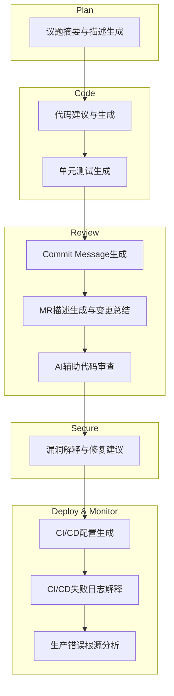

# 02.2 GitLab Duo实战：AI驱动的DevSecOps完整工作流

**作者**: Cline | **发布日期**: 2025-11-02 | **更新日期**: 2025-10-25 | **分类**: `AI工具链` `GitLab` `DevOps` `CI/CD` `DevSecOps`

**摘要**: 在AI赋能软件开发的浪潮中，GitLab Duo以前所未有的广度，将人工智能深深植入到从“计划”到“生产”的每一个环节。它不再仅仅是一个代码补全工具，而是一个贯穿整个DevSecOps生命周期的“平台级AI大脑”。本文将带你体验一次由GitLab Duo驱动的、端到端的完整开发工作流。我们将从一个Issue的AI摘要开始，到IDE中的代码生成与测试，再到AI辅助的提交与代码审查，最后延伸至CI/CD流水线的故障排查和安全漏洞修复。这不仅是对AI功能的巡礼，更是对未来软件开发协作模式的深度预演。

**SEO关键词**: GitLab Duo, AI辅助开发, 自动化Code Review, GitLab CI/CD, AI生成Merge Request, DevSecOps, 智能开发平台, GitHub Copilot对比

---

## 第1部分：GitLab Duo概览：平台级AI的愿景

与许多专注于IDE内部的AI工具不同，GitLab Duo的愿景是成为一个**贯穿整个软件开发生命周期的统一AI助理**。这意味着无论你是在规划史诗(Epics)、撰写议题(Issues)、编写代码、审查合并请求(Merge Requests)，还是在分析CI/CD失败日志和安全报告，Duo都能在当前上下文中为你提供智能辅助。

### 1.1 全生命周期覆盖



### 1.2 隐私与自托管

对于企业级用户，数据隐私是首要关切。GitLab Duo在设计上充分考虑了这一点，允许自托管（Self-Managed）的GitLab实例通过一个私有网关，连接到AI模型，确保用户的代码和数据不会被用于公开模型的训练，提供了企业级的安全保障。

---

## 第2部分：规划与编码阶段：从Issue到代码

### 2.1 AI在规划阶段：快速理解上下文

- **议题摘要 (`Summarize issue`)**: 当你面对一个包含了数十条评论、争论不休的复杂Issue时，无需从头阅读。在Issue页面右侧的GitLab Duo侧边栏，点击“Summarize issue”，AI会为你生成一个简洁的摘要，提炼出问题的核心、当前的讨论焦点和已有的建议方案。
- **生成议题描述 (`Generate issue description`)**: 创建Issue时，你只需写一个简单的标题，然后点击描述框中的AI图标，Duo就能为你生成一个结构化的描述模板，包含“问题陈述”、“提议方案”、“验收标准”等部分，极大地规范了团队的协作流程。

### 2.2 AI在IDE中：加速代码实现

通过GitLab的VS Code扩展或Web IDE，Duo提供了强大的编码辅助功能。

- **代码建议 (`Code Suggestions`)**: 当你输入代码或注释时，Duo会像Copilot一样，提供灰色的单行或多行代码补全建议。按下`Tab`即可接受。
- **解释代码 (`Explain Code`)**: 选中一段遗留代码，右键选择`GitLab: Explain Selected Code`，Duo会在聊天窗口中给出详细解释。
- **生成单元测试 (`Generate Tests`)**: 这是加速开发、保障代码质量的关键功能。选中一个函数，右键选择`GitLab: Generate Tests for Selected Code`，Duo会自动分析函数逻辑和边界情况，生成完整的测试用例。

**实战示例：为一个Python函数生成测试**

- **源代码 (`utils.py`)**:
  ```python
  def calculate_shipping_cost(weight, distance, is_premium_member):
      base_rate = 0.5
      cost = weight * base_rate + distance * 0.1
      if is_premium_member:
          cost *= 0.8 # 20% discount for premium members
      return round(cost, 2)
  ```
- **AI生成的测试 (`test_utils.py`)**:
  ```python
  import unittest
  from utils import calculate_shipping_cost

  class TestShippingCost(unittest.TestCase):
      def test_standard_member(self):
          self.assertEqual(calculate_shipping_cost(10, 50, False), 10.0)

      def test_premium_member(self):
          # 10.0 * 0.8 = 8.0
          self.assertEqual(calculate_shipping_cost(10, 50, True), 8.0)

      def test_zero_weight_and_distance(self):
          self.assertEqual(calculate_shipping_cost(0, 0, False), 0.0)

      def test_float_values(self):
          self.assertEqual(calculate_shipping_cost(5.5, 22.5, True), 6.2)
  ```

---

## 第3部分：提交与审查阶段：AI驱动的高效协作

这是GitLab Duo最具特色的功能之一，它将AI的能力从个人编码，延伸到了团队协作的核心环节。

### 3.1 AI生成提交信息

在Web IDE中暂存代码变更后，点击Commit Message输入框旁的✨图标，Duo会分析你的代码变更（diff），并自动生成一条符合[Conventional Commits](https://www.conventionalcommits.org/)规范的提交信息。

### 3.2 AI赋能合并请求 (Merge Request)

- **一键生成MR描述**: 当你从功能分支创建新的MR时，描述框顶部会出现一个`Generate merge request description`按钮。点击后，Duo会汇总该分支上的所有提交信息，并生成一份结构清晰的MR描述，包含“What does this MR do?”和“Why was this MR needed?”等部分，为审查者提供充足的背景信息。

- **总结代码变更 (For Reviewers)**: 对于审查者来说，面对一个包含数十个文件变更的大型MR，快速理解其核心改动是一项挑战。在MR的`Changes`标签页，Duo提供了一个`View summary`按钮。点击后，AI会以列表形式，清晰地总结出每个文件的核心变更内容，例如：
    > - **`utils.py`**: The `calculate_shipping_cost` function was modified to apply a 20% discount for premium members.
    > - **`test_utils.py` (New File)**: Added a new test suite to cover both standard and premium member scenarios for shipping cost calculation.

---

## 第4部分：CI/CD与安全阶段：AI赋能的DevSecOps

### 4.1 AI生成CI/CD配置

在`.gitlab-ci.yml`文件中，你可以直接通过注释或聊天窗口，让Duo为你生成CI/CD配置。

- **Prompt示例**: 
  ```yaml
  # GitLab Duo, generate a CI/CD configuration for a Python Django project.
  # It should include stages for linting with flake8, testing with pytest,
  # building a Docker image, and deploying to a staging environment.
  ```
  Duo会根据这个注释，生成一个包含多个作业（Jobs）和阶段（Stages）的完整`gitlab-ci.yml`文件。

### 4.2 AI解释CI/CD失败日志

当一个CI/CD作业失败时，其日志往往冗长而晦涩。在失败的作业日志页面，顶部会出现一个`Explain this failure`按钮。点击后，Duo会分析整个日志，定位到错误的关键部分，并用自然语言解释失败的原因，同时提供可能的解决方案。这对于排查复杂的构建或部署问题，能节省大量时间。

### 4.3 AI解释并修复安全漏洞

当GitLab的SAST（静态应用安全测试）或依赖扫描发现一个漏洞时，Duo能提供强大的辅助。

- **解释漏洞**: 在漏洞报告页面，点击`Explain this vulnerability`。Duo会详细解释这个漏洞的类型（如CWE-89: SQL Injection）、潜在的攻击方式、以及它可能对你的应用造成的危害。
- **生成修复方案**: 更强大的是，Duo还能根据漏洞的上下文，**直接生成用于修复该漏洞的代码片段**。例如，对于一个SQL注入漏洞，它会展示如何将存在风险的字符串拼接查询，重构为使用参数化查询的安全代码。

---

## 第5部分：运营与洞察阶段：AI驱动的价值流分析

- **生产错误根源分析**: 当GitLab的错误追踪系统捕获到一个生产环境的错误时，你可以使用Duo来分析其堆栈轨迹（Stack Trace）。Duo能够关联到具体的代码文件和行号，并进一步追溯到引入这个错误的commit和MR，从而快速定位问题的根源和负责人。

- **价值流预测**: 这是GitLab正在发展的方向。通过分析海量的历史项目数据（如议题的平均处理周期、MR的审查时长、部署频率等），Duo未来将能帮助项目经理预测功能的交付日期，识别开发流程中的瓶颈（例如，“我们的‘代码审查’阶段平均耗时3天，是整个流程中最长的环节”），并提出改进建议。

---

## 第6部分：GitLab Duo vs. GitHub Copilot Enterprise：生态之战

| 特性 | GitLab Duo Pro/Enterprise | GitHub Copilot Enterprise |
| :--- | :--- | :--- |
| **核心哲学** | **平台原生，端到端**。AI能力贯穿DevSecOps全生命周期。 | **代码原生，开发者优先**。AI能力围绕代码和开发者的IDE体验。 |
| **集成范围** | Issues, Epics, MRs, CI/CD, 安全报告, Web IDE, VS Code... | IDE, GitHub.com (PRs, Issues), CLI, Docs... |
| **独特优势** | 对CI/CD失败、安全漏洞的解释与修复建议；MR变更总结。 | 对整个代码库的深度理解和索引（Copilot Workspace）；与GitHub生态（如Actions）的无缝集成。 |
| **上下文来源** | 整个GitLab项目（代码、议题、MR、CI/CD日志等）。 | 整个GitHub仓库（代码、议题、PR、文档等）。 |
| **适用场景** | 使用GitLab作为**单一DevSecOps平台**的企业和团队。 | 使用GitHub作为**代码协作核心**，并可能搭配其他CI/CD和安全工具的团队。 |

**结论**: 这是一场生态系统之战。**GitHub Copilot**的策略是以开发者和IDE为中心，向外辐射到GitHub平台。而**GitLab Duo**的策略则是以其**端到端的DevSecOps平台**为载体，将AI能力注入到平台的每一个角落。你的选择，很大程度上取决于你的团队是以GitHub为中心，还是以GitLab为中心。

---

## 第7部分：总结：AI，DevSecOps的新引擎

GitLab Duo代表了软件开发的未来方向：AI不再仅仅是一个辅助编码的工具，而是成为整个开发运维流程的“智能操作系统”。它通过在规划、编码、审查、测试、安全和部署的每一个关键节点提供上下文感知的智能辅助，极大地减少了开发流程中的摩擦，提升了代码质量和安全性，并最终加速了价值的交付。拥抱GitLab Duo这样的平台级AI，意味着选择了一种更高效、更智能、更具协作性的未来开发模式。

## 参考资料

1.  [GitLab Duo Official Page](https://about.gitlab.com/gitlab-duo/)
2.  [GitLab Duo Pro Documentation](https://docs.gitlab.com/ee/user/ai/)
3.  [GitHub Copilot Enterprise](https://github.com/features/copilot#enterprise)