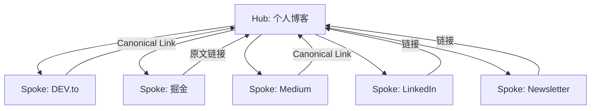

# 03.2 终极内容分发策略：一文多发，覆盖全网技术社区

**作者**:Cline | **发布日期**: 2025-11-11 | **更新日期**: 2025-10-25 | **分类**: `IP实战` `个人品牌` `内容营销` `自动化`

**摘要**: 在“酒香也怕巷子深”的数字时代，将你的深度内容只发布在一个平台，是对其价值的最大浪费。本篇终极指南将深入探讨“一源多用"(Create Once, Distribute Everywhere)的策略，教你如何将一篇精心创作的基石文章，进行多平台、多形式的分发，覆盖从个人博客到海内外主流技术社区，再到私域流量池的每一个角落。我们将从“辐射模型”的顶层战略设计开始，深入各个平台的特性与内容适配技巧，并最终提供一套包含图片上传、浏览器自动化的Node.js终极脚本，实现影响力最大化。

**SEO关键词**: 内容分发, 一文多发, 技术写作, 个人品牌, 内容营销, 自动化发布, Puppeteer, Notion, Canonical URL

---

## 第1部分：顶层战略：“辐射模型”与为何要分发

### 1.1 “辐射模型” (Hub-and-Spoke Model)

这是我们所有分发策略的指导思想。
- **中心 (Hub)**: 你的**个人博客** (`your-domain.com`)。它是所有内容的权威来源、最终归宿和SEO权重的核心承载者。
- **辐条 (Spokes)**: **所有其他平台**（Medium, DEV.to, 掘金, LinkedIn, Newsletter等）。它们是触达新用户的渠道，是放大你影响力的“扩音器”。

**核心流程**: 在Hub发布原创内容，然后将内容适配后，分发到各个Spoke平台，并从每个Spoke都建立指回到Hub的链接。这不仅能带来直接的引流，更能构建强大的外部链接网络，极大提升你主站的SEO权威。



### 1.2 分发的四大核心价值

1.  **触达增量用户**: 每个平台都有其独特的、重叠度不高的用户群体。
2.  **构建跨平台品牌**: 在用户常去的每个地方都能看到你的名字，建立权威感。
3.  **增强SEO**: 来自高权重网站的外链是提升你主站排名的“金票”。
4.  **分散风险**: 避免因单一平台政策变动或衰落，导致你的内容资产归零。

---

## 第2部分：平台深度解析与运营策略 (扩展版)

### 2.1 国际技术社区

- **Medium**: 
    - **受众**: 全球技术爱好者、产品经理、设计师，读者群广泛。
    - **策略**: 适合发布具有**故事性、深度思考、跨界结合**的文章。标题要引人入胜（如“How I...”, “The Surprising Truth about...”）。善用出版物(Publications)功能来获得初始曝光。

- **DEV Community (DEV.to)**: 
    - **受众**: 纯粹的全球开发者社区，氛围友好，乐于分享。
    - **策略**: 内容要**硬核、直接**。多用代码片段，支持丰富的Markdown扩展(Liquid Tags)。**标签(Tags)**是流量的关键，务必选择4个最相关的标签。

- **Hashnode**:
    - **受众**: 介于Medium和DEV.to之间，同样是全球开发者社区。
    - **策略**: 平台对自定义域名和SEO设置非常友好，可以作为个人博客的替代或镜像。其“赞助”功能也为创作者提供了直接的变现渠道。

### 2.2 国内技术社区

- **掘金 (Juejin)**:
    - **受众**: 中国大陆中青年开发者，前端开发者占比较高，社区氛围活跃。
    - **策略**: **追热点、重实践、排版精美**。标题要吸引眼球，善用Emoji。精心设计的封面图能极大提升点击率。积极参与平台的“更文挑战”等活动能获得巨大流量扶持。

- **CSDN**:
    - **受众**: 用户基数极大，覆盖从学生到资深开发者的各个人群，初学者占比较高。
    - **策略**: **SEO为王**。标题必须包含在百度上搜索量大的关键词。内容要结构化，多用平台自带的“代码片”、“专栏”等功能。由于其在百度的高权重，一篇好的CSDN文章能带来持续的搜索流量。

### 2.3 新增重要渠道

- **LinkedIn Articles**: 
    - **受众**: 职场人士、技术经理、招聘者。
    - **策略**: **将技术内容“商业化”包装**。不要只贴代码，要将重点放在这项技术能为团队/公司带来的“商业价值”上。例如，一篇关于CI/CD的文章，在LinkedIn上可以包装成“如何通过自动化部署，将团队的发布效率提升50%”。多使用商务语言，引发关于职业成长和团队管理的讨论。

- **邮件Newsletter (Substack/ConvertKit)**:
    - **受众**: 你的“核心粉丝”，对你信任度最高的用户群体。
    - **策略**: **提供“导演剪辑版”内容**。不要只发送文章链接。在邮件中，分享你在写这篇文章时的“幕后故事”、未在公开发布版本中提及的个人思考、或一个专属的补充资源。这让订阅者感到自己获得了“特殊待遇”，从而建立更深的连接。

---

## 第3部分：内容适配矩阵：高效的“一文多改”清单

| 适配项 | 个人博客 (Hub) | DEV.to / Hashnode | 掘金 | LinkedIn | 
| :--- | :--- | :--- | :--- | :--- |
| **标题** | SEO友好，清晰准确 | 直截了当，突出技术点 | 善用Emoji和热词，制造吸引力 | 聚焦商业价值、职业成长 | 
| **引言** | “钩子”+痛点+解决方案 | 直接点明本文要解决的技术问题 | 用一个有趣的问题或场景开头 | 从一个行业痛点或管理挑战切入 | 
| **代码示例** | 完整、可复制 | 完整，可使用Liquid Tag嵌入 | 完整，确保高亮美观 | **精简或删除**，用伪代码或流程图替代 | 
| **语言风格** | 专业、严谨 | 轻松、社区化 | 活泼、网络化 | 专业、商务 | 
| **图片/媒体** | 高清原创图 | GIF动图、技术梗图 | 精心设计的封面图、流程图 | 专业的图表、数据、架构图 | 
| **CTA** | 引导**订阅Newsletter** | 引导**评论和讨论** | 引导**点赞、收藏、关注** | 引导**讨论和分享观点** | 

---

## 第4部分：终极自动化工作流 (Node.js + Puppeteer)

我们将构建一个Node.js脚本，实现以下流程：
1.  读取本地Markdown文件。
2.  自动上传文中的本地图片到**Cloudinary**图床，并替换链接。
3.  调用API发布到DEV.to和Hashnode。
4.  **使用Puppeteer模拟浏览器操作，自动发布到掘金**。

**前提**: `npm install gray-matter cloudinary glob fs-extra puppeteer`

### 4.1 核心脚本 `publish.js` (包含图片上传和Puppeteer)

```javascript
// publish.js
require('dotenv').config();
const fs = require('fs-extra');
const path = require('path');
const matter = require('gray-matter');
const cloudinary = require('cloudinary').v2;
const puppeteer = require('puppeteer');
const config = require('./config'); // 你的密钥配置文件

// --- 模块1: 图片上传 --- //
cloudinary.config(config.cloudinary);
async function uploadImage(filePath) { /* ... (省略与05.5教程中相同的图片上传逻辑) ... */ }

// --- 模块2: Markdown预处理 --- //
async function preprocessMarkdown(filePath) { /* ... (省略与05.5教程中相同的预处理逻辑，包含图片链接替换) ... */ }

// --- 模块3: API平台发布 --- //
async function publishToDevto(content, frontmatter) { /* ... (省略API调用逻辑) ... */ }
async function publishToHashnode(content, frontmatter) { /* ... (省略API调用逻辑) ... */ }

// --- 模块4: Puppeteer发布到掘金 (重点) --- //
async function publishToJuejin(title, markdownContent) {
  console.log('\n🚀 Publishing to Juejin via Puppeteer...');
  const browser = await puppeteer.launch({ headless: false, defaultViewport: { width: 1440, height: 900 } });
  const page = await browser.newPage();

  try {
    // 1. 注入Cookie，实现免登录
    console.log('  -> Setting cookies...');
    const cookies = config.browser.juejin.cookie.split('; ').map(pair => {
      const [name, ...value] = pair.split('=');
      return { name, value: value.join('='), domain: '.juejin.cn' };
    });
    await page.setCookie(...cookies);

    // 2. 打开创作页面
    console.log('  -> Navigating to editor...');
    await page.goto('https://juejin.cn/editor/drafts/new?v=2', { waitUntil: 'networkidle2' });
    await page.waitForSelector('.bytemd');

    // 3. 填充标题
    console.log('  -> Typing title...');
    await page.type('.title-input .bytemd-tippy-right', title, { delay: 100 });

    // 4. 粘贴Markdown内容
    console.log('  -> Pasting content...');
    await page.evaluate((content) => {
      const editor = document.querySelector('.bytemd-editor .CodeMirror').CodeMirror;
      editor.setValue(content);
    }, markdownContent);
    await page.waitForTimeout(2000); // 等待编辑器渲染

    // 5. 点击“发布”按钮，打开发布设置弹窗
    console.log('  -> Opening publish dialog...');
    await page.click('button.publish-btn');
    await page.waitForSelector('.publish-popup');

    // 6. (可选) 在弹窗中进行封面上传、标签选择等操作
    // ... 此处可以编写更复杂的逻辑来上传封面、选择分类等 ...

    // 7. 点击最终的发布按钮
    // await page.click('.publish-popup .confirm-btn'); // 注意：为防止意外，此行默认注释
    console.log('✅ Successfully prepared article on Juejin. Please complete the final publish step in the browser.');
    await page.waitForTimeout(10000); // 留出10秒手动检查和点击

  } catch (error) {
    console.error(`❌ Failed to publish to Juejin: ${error.message}`);
    await page.screenshot({ path: 'juejin_error.png' }); // 截图以供调试
  } finally {
    await browser.close();
  }
}

// --- 主执行函数 --- //
async function main() {
  const filePath = process.argv[2];
  // ... (主逻辑，调用preprocessMarkdown, 然后依次调用各个发布函数)
}

main();
```
**注意**: Puppeteer脚本非常“脆弱”，它强依赖于目标网站的DOM结构。一旦掘金的前端代码更新，选择器（如`.title-input`）可能就会失效，需要手动更新。`headless: false`可以在调试时打开一个真实的浏览器，方便你观察每一步的操作。

---

## 第5部分：效果追踪与优化：分发仪表盘

发布不是终点，而是数据收集的开始。你需要知道哪个渠道的努力是值得的。

- **核心指标**: 
    - **浏览量 (Views)**: 内容的曝光度。
    - **互动率 (Engagement)**: 点赞、评论、收藏等，反映了内容的质量。
    - **引流推荐量 (Referral Traffic)**: **最重要的指标**。有多少用户通过这篇文章，最终访问了你的个人博客？

- **追踪工具：UTM参数**
    - 在你发布到各个平台的文章末尾的“原文链接”上，添加不同的UTM参数。
    - **掘金链接**: `https://your-domain.com/my-article?utm_source=juejin&utm_medium=referral`
    - **DEV.to链接**: `https://your-domain.com/my-article?utm_source=devto&utm_medium=referral`
    - **效果**: 在你的Google Analytics后台，进入`流量获取`报告，你将能清晰地看到，来自`juejin`和`devto`的流量分别是多少，以及这些流量后续的转化行为（如Newsletter订阅率）。

- **Notion仪表盘模板**: 创建一个数据库，用于追踪每篇文章在各平台的表现，帮助你进行月度复盘，调整分发策略。

## 结论

现代内容创作者，必须是一个“系统思想家”。通过建立“辐射模型”的战略，利用“内容适配矩阵”进行战术微调，并最终借助“自动化脚本”来规模化执行，你可以将单篇文章的影响力放大数倍乃至数十倍。这个过程虽然前期投入较大，但一旦你的内容分发“机器”开始运转，它将为你带来源源不断的流量、影响力和机会，构建起一个难以被超越的、跨平台的个人品牌护城河。

## 参考资料

1.  [Puppeteer Documentation](https://pptr.dev/)
2.  [Cloudinary Node.js SDK](https://cloudinary.com/documentation/node_integration)
3.  [Google Campaign URL Builder (UTM参数生成器)](https://ga-dev-tools.google/campaign-url-builder/)