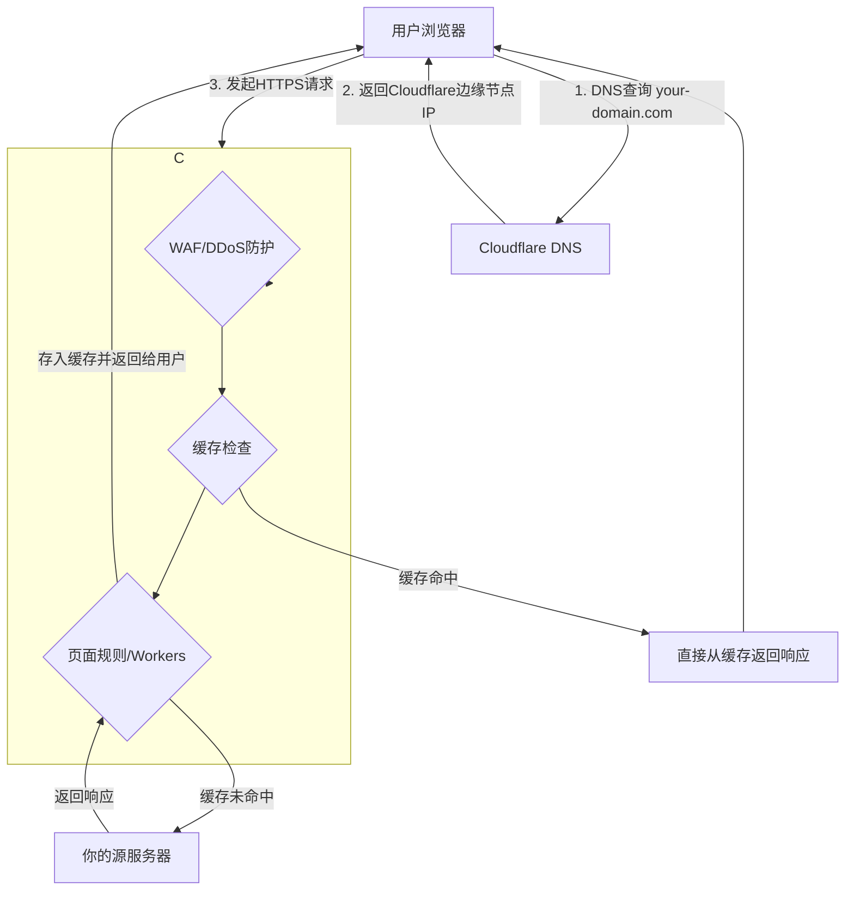

# 04.3 Cloudflare终极指南：免费为你的网站套上“金钟罩”

**作者**: Cline | **发布日期**: 2025-11-22 | **更新日期**: 2025-10-25 | **分类**: `云端基建` `Cloudflare` `CDN` `网络安全`

**摘要**: 无论你的服务器性能多强、代码优化多好，用户与服务器之间的物理距离和互联网上无处不在的安全威胁，都是无法回避的挑战。而Cloudflare，正是为解决这两个问题而生的“瑞士军刀”。它不仅仅是一个CDN，更是一个集DNS解析、SSL证书、DDoS防护、WAF防火墙于一体的综合性网络安全与性能平台。最惊人的是，其免费套餐已强大到足以满足绝大多数个人项目和中小型网站的需求。本篇终极指南将带你从零开始，为一个域名完整地配置Cloudflare的免费服务，并深入探索其页面规则、防火墙和Workers等高级功能，为你的网站套上刀枪不入的“金钟罩”和风驰电掣的“筋斗云”。

**SEO关键词**: Cloudflare教程, 免费CDN, SSL证书, DDoS防护, WAF防火墙, Page Rules, Cloudflare Workers, 网站性能优化

---

## 第1部分：Cloudflare工作原理：位于世界边缘的“智能代理”

要用好Cloudflare，首先要理解它的核心工作模式：**反向代理 (Reverse Proxy)**。

当你将网站接入Cloudflare后，你实际上是做了一件事：将你域名的DNS解析权，交给了Cloudflare。从此，所有访问你网站的用户，都不再直接连接到你的服务器，而是连接到离他们最近的Cloudflare全球边缘节点。

**一个请求的旅程**: 


**核心优势**: 
- **安全**: 你的源服务器IP被完全隐藏，所有恶意流量在到达你的服务器之前，就被Cloudflare的边缘节点清洗掉了。
- **性能**: 静态资源甚至整个HTML页面都可以被缓存在边缘节点，用户从全球任何地方访问，都能获得极低的延迟。

---

## 第2部分：接入Cloudflare：从注册到DNS接管

(此部分与上一版内容基本一致，包括创建账号、添加站点、检查DNS记录、更改Nameservers等步骤，此处为保持篇幅，摘要说明)

- **关键步骤**: 在你的域名注册商（如GoDaddy, Namecheap）处，将域名的DNS服务器地址，修改为Cloudflare提供给你的两个地址（如`ali.ns.cloudflare.com`）。
- **“橙色云” vs “灰色云”**: 
    - 在Cloudflare的DNS记录页面，每一条记录旁都有一个云朵图标。
    - **橙色云 (Proxied)**: 意味着该记录的流量将通过Cloudflare的代理，享受CDN和安全防护。这是`www`、`@`（根域名）等Web流量的**标准配置**。
    - **灰色云 (DNS Only)**: 意味着Cloudflare只提供DNS解析服务，流量将直接指向你的源服务器IP。**这会暴露你的服务器IP！** 通常只用于非HTTP流量，例如邮件服务的`MX`记录，或用于让你能通过`ssh.your-domain.com`直接SSH连接服务器的`A`记录。

---

## 第3部分：SSL/TLS加密模式深度配置

### 3.1 四种加密模式解析

- **Off**: 不加密。
- **Flexible**: **不安全**。浏览器到Cloudflare加密，但Cloudflare到你的服务器是明文。
- **Full**: 加密，但Cloudflare不验证你服务器证书的真伪。可以使用自签名证书。
- **Full (Strict)**: **最安全，强烈推荐**。Cloudflare会严格验证你的源服务器上有一个有效的、受信任的SSL证书。

### 3.2 实现“Full (Strict)”模式

- **方法一: Let's Encrypt**: 在源服务器上使用`certbot`自动申请和配置证书。
- **方法二: Cloudflare Origin Certificate (推荐)**: 
    - 在Cloudflare `SSL/TLS` -> `源服务器`页面，免费创建一张有效期长达15年的源服务器专用证书。
    - 将生成的证书(`cert.pem`)和私钥(`key.pem`)保存到你的服务器上。
    - **Nginx完整配置示例**:
      ```nginx
      server {
          listen 443 ssl http2;
          server_name your-domain.com;

          # --- Cloudflare源证书配置 ---
          ssl_certificate /etc/nginx/certs/cert.pem;
          ssl_certificate_key /etc/nginx/certs/key.pem;

          # --- 推荐的SSL安全配置 ---
          ssl_protocols TLSv1.2 TLSv1.3;
          ssl_ciphers 'ECDHE-ECDSA-AES128-GCM-SHA256:ECDHE-RSA-AES128-GCM-SHA256:ECDHE-ECDSA-AES256-GCM-SHA384:ECDHE-RSA-AES256-GCM-SHA384:ECDHE-ECDSA-CHACHA20-POLY1305:ECDHE-RSA-CHACHA20-POLY1305:DHE-RSA-AES128-GCM-SHA256:DHE-RSA-AES256-GCM-SHA384';
          ssl_prefer_server_ciphers off;
          ssl_session_cache shared:SSL:10m;
          ssl_session_timeout 1d;
          ssl_session_tickets off;

          # ... 你的proxy_pass等其他配置 ...
      }
      ```

### 3.3 开启HSTS

在`SSL/TLS` -> `边缘证书`页面，开启`HTTP严格传输安全(HSTS)`。这会告诉浏览器，在未来的一段时间内（如6个月），访问你的网站**必须**使用HTTPS，杜绝任何中间人降级攻击的可能。

---

## 第4部分：缓存与速度优化：榨干免费套餐的性能

### 4.1 页面规则 (Page Rules) 高级玩法

免费套餐提供3条宝贵的页面规则，必须用在刀刃上。

- **规则1: 强化后台安全，禁止缓存**
  - **URL**: `*your-domain.com/admin/*`
  - **设置**: `安全级别: 高`, `缓存级别: 不缓存`, `禁用性能`, `禁用应用程序`

- **规则2: 强制缓存一切 (适用于静态网站)**
  - **URL**: `*your-domain.com/*`
  - **设置**: `缓存级别: 缓存所有内容`, `边缘缓存TTL: 一个月`
  - **说明**: 这条规则极其强大，它会把你的整个HTML页面都缓存在Cloudflare的边缘节点，实现“瞬时”加载，TTFB可以降至50ms以下。

- **规则3: 永久重定向 (实现301跳转)**
  - **URL**: `*your-domain.com/old-blog-path/*`
  - **设置**: `转发URL (Forwarding URL)` -> `301永久重定向` -> `https://your-domain.com/new-blog-path/$1`
  - **说明**: 无需修改服务器配置，即可在边缘节点实现URL的跳转。

### 4.2 缓存规则 (Cache Rules)

这是比页面规则更现代、更灵活的缓存控制方式。你可以创建更复杂的规则，例如，基于请求头或Cookie来决定是否缓存。

---

## 第5部分：防火墙与安全性配置

### 5.1 WAF防火墙规则

免费套餐提供5条防火墙规则，你可以用它来构建一个强大的安全屏障。

- **规则1: 质询低信誉分访客**
  - **表达式**: `(cf.threat_score > 10)`
  - **操作**: `质询 (Managed Challenge)`
  - **说明**: 利用Cloudflare的AI评分，对可疑访客进行人机验证，有效阻挡大部分机器人。

- **规则2: 屏蔽对敏感文件的访问**
  - **表达式**: `(http.request.uri.path contains "/wp-config.php") or (http.request.uri.path contains "/.env")`
  - **操作**: `阻止 (Block)`

- **规则3: 保护登录页面**
  - **表达式**: `(http.request.uri.path eq "/login")`
  - **操作**: `质询 (Managed Challenge)`

### 5.2 速率限制 (Rate Limiting)

免费套餐提供1条速率限制规则，非常适合保护登录或API端点，防止暴力破解。

- **配置示例**: 
    1.  进入`安全性` -> `速率限制` -> `创建规则`。
    2.  **URL**: `https://your-domain.com/api/login`
    3.  **标准**: `IP地址` | `10`次请求 | `1分钟`
    4.  **操作**: `阻止` | `10分钟`
- **效果**: 如果同一个IP地址在1分钟内尝试登录超过10次，Cloudflare会自动将其封禁10分钟。

---

## 第6部分：终极玩法：Cloudflare Workers

Cloudflare Workers让你能在全球所有边缘节点上，运行你自己的JavaScript代码，在请求到达你的源服务器之前，对其进行拦截和修改。

### 6.1 用例一：在边缘添加安全头

```javascript
// index.js
export default {
  async fetch(request, env, ctx) {
    // 获取源服务器的响应
    const response = await fetch(request);

    // 创建一个可修改的新响应
    const newResponse = new Response(response.body, response);

    // 添加安全相关的响应头
    newResponse.headers.set('Content-Security-Policy', "default-src 'self';");
    newResponse.headers.set('X-Frame-Options', 'SAMEORIGIN');
    newResponse.headers.set('X-Content-Type-Options', 'nosniff');

    return newResponse;
  },
};
```
这个简单的Worker，就能为你的网站统一加上重要的安全头，而无需修改任何服务器代码。

### 6.2 用例二：在边缘实现A/B测试

如`05.9`教程所述，你可以使用Worker根据用户的Cookie，动态地修改返回HTML中的`<title>`和`<meta>`标签，从而在静态网站上实现复杂的A/B测试。

## 结论

Cloudflare的免费套餐是所有网站开发者都应该掌握的“基础设施级”工具。它像一个忠诚的、7x24小时工作的保安兼快递员，在不花费你一分钱的情况下，为你的网站提供了企业级的安全防护和全球加速网络。通过熟练掌握其DNS代理、SSL模式、页面规则、防火墙，乃至Workers等高级功能，你可以将一个普通的网站，武装成一个难以被攻破、全球访问如飞的“网络堡垒”。

## 参考资料

- [Cloudflare 官方网站](https://www.cloudflare.com/)
- [Cloudflare Workers Documentation](https://developers.cloudflare.com/workers/)
- [MDN Web Docs: HTTP Strict Transport Security (HSTS)](https://developer.mozilla.org/en-US/docs/Web/HTTP/Headers/Strict-Transport-Security)