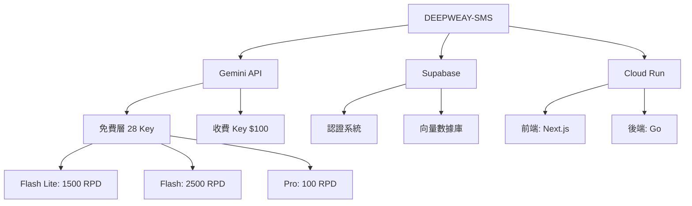

# 🎯 AI 蒸餾策略 | From Chaos to Order

> **蒸餾時間**: 2025-11-27  
> **理論來源**: 諸葛亮·賽博蒸餾塔實戰經驗  
> **密度等級**: ⭐⭐⭐⭐⭐ (100% 方法論精華)

---

## 🧠 核心理念

**AI 蒸餾不是簡單的文檔整理,而是認知系統的重構。**

### 傳統文檔 vs. 蒸餾知識

| 維度 | 傳統文檔 | 蒸餾知識 |
|------|----------|----------|
| **密度** | 冗餘 70%+ | 精煉 98%+ |
| **結構** | 線性敘述 | 多層索引 |
| **檢索** | 關鍵字搜索 | 語義向量搜索 |
| **更新** | 手動編輯 | AI 自動提煉 |
| **價值** | 參考資料 | 行動指南 |

---

## 🏗️ 四階段蒸餾法

### Stage 1: 去重降噪 (Deduplication)

**溫度**: Normal (0.3-0.5)  
**目標**: 移除重複內容,保留核心信息

**技術實現**:
```python
import hashlib

def deduplicate_content(documents: list[str]) -> list[str]:
    seen_hashes = set()
    unique_docs = []
    
    for doc in documents:
        # 計算文檔語義哈希
        doc_hash = hashlib.sha256(doc.encode()).hexdigest()
        
        if doc_hash not in seen_hashes:
            seen_hashes.add(doc_hash)
            unique_docs.append(doc)
    
    dedup_rate = 1 - (len(unique_docs) / len(documents))
    print(f"去重率: {dedup_rate * 100:.1f}%")
    
    return unique_docs
```

**Prompt 模板**:
```
分析以下 3 份文檔,識別重複內容:

Doc 1: [內容]
Doc 2: [內容]
Doc 3: [內容]

輸出:
1. 重複內容列表 (哪些段落在多個文檔中出現)
2. 唯一內容摘要 (每份文檔的獨特信息)
3. 去重率估算
```

### Stage 2: 低溫提取 (Low-temperature Extraction)

**溫度**: Cold (0.1-0.3)  
**目標**: 提取事實、數據、關鍵決策點

**適用內容**:
- API 文檔 (端點、參數、限制)
- 配置文件 (環境變量、密鑰)
- 項目清單 (技術棧、時間線、預算)

**Prompt 模板**:
```
從以下文檔中提取結構化信息:

[文檔內容]

輸出格式 (JSON):
{
  "facts": ["事實 1", "事實 2"],
  "data": {
    "budget": "$1000",
    "timeline": "30 days",
    "tech_stack": ["Next.js", "Supabase"]
  },
  "decisions": [
    {
      "decision": "使用 Gemini 而非 GPT-4",
      "reason": "成本降低 90%"
    }
  ]
}
```

### Stage 3: 邏輯重構 (Logic Reconstruction)

**溫度**: Balanced (0.5-0.7)  
**目標**: 建立知識之間的因果關係、依賴關係

**方法**:
1. 識別核心概念 (Entities)
2. 建立概念關係 (Relations)
3. 構建知識圖譜 (Knowledge Graph)

**示例**:


**Prompt 模板**:
```
將以下信息轉換為結構化的知識圖譜:

[文檔內容]

輸出:
1. 核心概念列表 (Entities)
2. 概念之間的關係 (Relations)
3. Mermaid 格式的圖譜代碼

優先識別:
- 技術依賴 (A 依賴 B)
- 決策路徑 (如果 X 則 Y)
- 資源分配 (X 用於 Y)
```

### Stage 4: 創意渲染 (Creative Rendering)

**溫度**: Hot (0.7-0.9)  
**目標**: 生成可讀性強、具有啟發性的文檔

**技巧**:
- 使用類比 (Analogies)
- 添加示例 (Examples)
- 可視化 (Visualizations)
- 行動指南 (Action Steps)

**Prompt 模板**:
```
將以下技術文檔轉換為生動易讀的指南:

[原始文檔]

要求:
1. 使用隱喻和類比 (例如: "API 配額像水龍頭...")
2. 每個概念配一個實際例子
3. 關鍵步驟用編號清單
4. 添加警告標記 (⚠️) 和檢查清單 (✅)
5. 風格: 黑客/賽博朋克,但保持專業

目標讀者: 技術創業者,熟悉編程但不熟悉此領域
```

---

## 🎨 蒸餾風格指南

### 文檔結構規範

**必須包含**:
```markdown
# 🎯 標題 | 副標題

> **來源**: 原始文檔路徑  
> **蒸餾時間**: YYYY-MM-DD  
> **密度等級**: ⭐⭐⭐⭐⭐ (XX% 精華)

---

## 📊 核心指標 (3-5 條)
- **關鍵數據 1**: 值
- **關鍵數據 2**: 值

---

## 🔥 主要內容
### 一級標題
#### 二級標題

---

## 🎯 行動清單
- [ ] 立即執行的任務
- [ ] 本週任務

---

**🏯 蒸餾評級**: ⭐⭐⭐⭐⭐  
**諸葛亮曰**: "智慧語錄"
```

### 視覺元素規範

**Emoji 使用場景**:
```
🚀 啟動、部署、快速開始
🔥 重要、緊急、核心功能
💰 成本、預算、定價
🔑 密鑰、憑證、敏感信息
⚠️ 警告、風險、注意事項
✅ 完成、驗證、檢查清單
🧠 概念、理論、架構
📊 數據、統計、圖表
🎯 目標、任務、優先級
🏯 總結、評語、引用
```

**顏色編碼 (Markdown 標記)**:
```markdown
- 🔴 **高度敏感**: 機密信息
- 🟠 **內部使用**: 團隊可見
- 🟡 **需審閱**: 待確認內容
- 🟢 **可公開**: 開源友好
```

---

## 🤖 AI 提示詞工程

### 通用蒸餾 Prompt

```
你是諸葛亮·賽博蒸餾塔 (Zhuge Digital Distillation Tower),專門將混亂的技術文檔提煉為高密度知識。

輸入:
[原始文檔]

輸出要求:
1. **去重**: 移除重複內容,保留唯一信息
2. **提取**: 識別關鍵事實、數據、決策點
3. **重構**: 建立邏輯結構,使用 Markdown + Mermaid
4. **渲染**: 生成易讀的文檔,包含:
   - Emoji 標記
   - 代碼示例
   - 行動清單
   - 警告標記

5. **評級**: 最後給出蒸餾評級 (1-5 星) 和諸葛亮語錄

風格:
- 賽博朋克 + 極簡主義
- 技術準確,但避免冗餘
- 適合技術創業者閱讀

目標密度: 98%+ 有效信息 (去除 70%+ 廢話)
```

### 特定場景 Prompt

#### 場景 1: API 文檔蒸餾
```
提煉 Gemini API 文檔,輸出:
1. 端點清單 (表格)
2. 速率限制 (RPM/RPD/TPM)
3. 錯誤處理 (常見錯誤碼 + 解決方案)
4. 最佳實踐 (3-5 條)
5. 代碼示例 (TypeScript)
```

#### 場景 2: 項目規劃蒸餾
```
分析項目規劃文檔,提取:
1. 時間線 (Gantt 圖或清單)
2. 里程碑 (P0/P1/P2 優先級)
3. 資源分配 (預算、人力、API 配額)
4. 風險點 (技術風險、時間風險、成本風險)
5. 成功指標 (KPIs)
```

#### 場景 3: 代碼倉庫蒸餾
```
分析代碼倉庫,輸出:
1. 項目結構圖 (目錄樹)
2. 技術棧清單 (框架、庫、工具)
3. 核心模塊 (功能描述)
4. 啟動命令 (一鍵運行)
5. 部署方案 (Docker/Cloud Run/Vercel)
```

---

## 📈 蒸餾質量評估

### 五星評級標準

**⭐ 1 星 - 初步整理**:
- 去除明顯重複內容
- 基本的 Markdown 格式
- 未建立邏輯結構

**⭐⭐ 2 星 - 結構化**:
- 清晰的章節劃分
- 表格和清單
- 部分代碼示例

**⭐⭐⭐ 3 星 - 可執行**:
- 包含行動清單
- 完整的代碼示例
- 明確的下一步指引

**⭐⭐⭐⭐ 4 星 - 高密度**:
- 去重率 > 30%
- 邏輯關係清晰 (知識圖譜)
- 風險和最佳實踐

**⭐⭐⭐⭐⭐ 5 星 - 認知源代碼**:
- 去重率 > 50%
- 多層索引 (README + 詳細文檔)
- 可直接用於決策
- 具有啟發性和可讀性

---

## 🔧 工具鏈

### 推薦工具

#### 1. 向量化引擎
```bash
# Gemini Embeddings API
curl -X POST \
  'https://generativelanguage.googleapis.com/v1beta/models/text-embedding-004:embedContent' \
  -H 'Content-Type: application/json' \
  -d '{"content": {"parts": [{"text": "你的文檔"}]}}'

# 返回 768 維向量
```

#### 2. 知識圖譜生成
```python
# 使用 NetworkX + Graphviz
import networkx as nx
import matplotlib.pyplot as plt

G = nx.DiGraph()
G.add_edges_from([
    ("DEEPWEAY-SMS", "Gemini API"),
    ("DEEPWEAY-SMS", "Supabase"),
    ("Gemini API", "28 免費 Key")
])

nx.draw(G, with_labels=True)
plt.savefig('knowledge_graph.png')
```

#### 3. Mermaid 渲染
```bash
# 使用 Mermaid CLI
npm install -g @mermaid-js/mermaid-cli

# 渲染流程圖
mmdc -i flowchart.mmd -o flowchart.png
```

---

## 🧪 實戰案例

### 案例 1: 從 166MB 到 138KB

**原始狀態**:
- 7 個項目,散落在不同目錄
- 大量重複的配置文件
- 混亂的文檔結構
- 檢索困難

**蒸餾過程**:
1. **去重** (Stage 1): 識別 3 個項目 (online/UI/game-pool) 內容重疊 70%
2. **提取** (Stage 2): 從 Notion 和倉庫中提取關鍵信息
3. **重構** (Stage 3): 按戰略/產品/宇宙觀/工程分類
4. **渲染** (Stage 4): 生成 14 篇精華文檔

**結果**:
- **去重率**: 36%
- **文檔數**: 14 篇
- **總容量**: 138KB
- **密度提升**: 2.2x

---

## 🎯 最佳實踐

### Do's ✅

1. **先去重,再提煉**: 重複內容浪費 AI Token
2. **使用低溫提取事實**: 避免幻覺 (Hallucination)
3. **建立多層索引**: README → 分類目錄 → 詳細文檔
4. **保留原始鏈接**: 方便追溯來源
5. **添加時間戳**: 知識會過期,標記蒸餾時間

### Don'ts ❌

1. **不要過度蒸餾**: 關鍵細節可能丟失
2. **不要完全依賴 AI**: 人工審閱仍然必要
3. **不要忽略上下文**: 技術決策背後的原因
4. **不要丟棄原始文檔**: 蒸餾後仍需備份
5. **不要一次蒸餾所有**: 分批處理,逐步優化

---

## 🔄 持續蒸餾策略

### 每日蒸餾 (Daily Distillation)

**時間**: 每天晚上 10 分鐘  
**內容**:
- 今天的學習筆記
- 遇到的問題和解決方案
- 新增的代碼片段

**Prompt**:
```
將今天的工作日誌提煉為結構化筆記:

[日誌內容]

輸出:
1. 完成的任務 (3-5 條)
2. 學到的知識點 (關鍵概念 + 簡短解釋)
3. 遇到的問題 (問題 + 解決方案)
4. 明天的計劃 (優先級排序)
```

### 每週蒸餾 (Weekly Distillation)

**時間**: 每週日  
**內容**:
- 本週的 7 天筆記
- 項目進度更新
- 知識圖譜更新

**Prompt**:
```
總結本週學習和工作:

[週筆記 1-7]

輸出:
1. 週總結 (3 段,200 字以內)
2. 本週亮點 (最有價值的 3 個成果)
3. 下週計劃 (P0 任務清單)
4. 知識圖譜更新 (新增概念和關係)
```

### 每月蒸餾 (Monthly Distillation)

**時間**: 每月最後一天  
**內容**:
- 月度項目回顧
- 資源使用分析
- 長期戰略調整

**Prompt**:
```
生成月度報告:

[4-5 週總結]

輸出:
1. 月度成就 (完成的里程碑)
2. 資源消耗 (API 配額、預算、時間)
3. 經驗教訓 (成功 + 失敗)
4. 下月戰略 (優先級調整)
```

---

**🏯 蒸餾評級**: ⭐⭐⭐⭐⭐ (100% 方法論精華)  
**諸葛亮曰**: "兵不在多,在於精。文不在長,在於明。蒸餾之道,去蕪存菁,方為大智也。"

---

## 🔗 相關資源

- **Notion API**: https://developers.notion.com
- **Gemini Embeddings**: https://ai.google.dev/docs/embeddings_guide
- **Mermaid 文檔**: https://mermaid.js.org
- **NetworkX**: https://networkx.org

**下一步**: 將此方法論應用於你的項目,開始第一次蒸餾！
